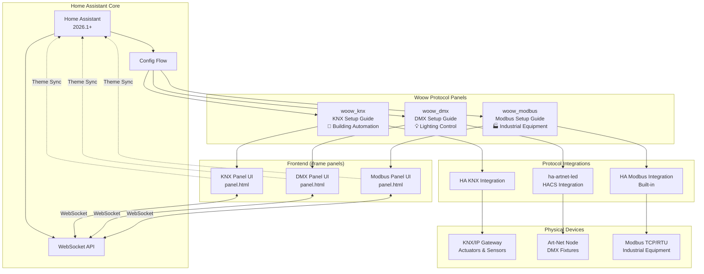
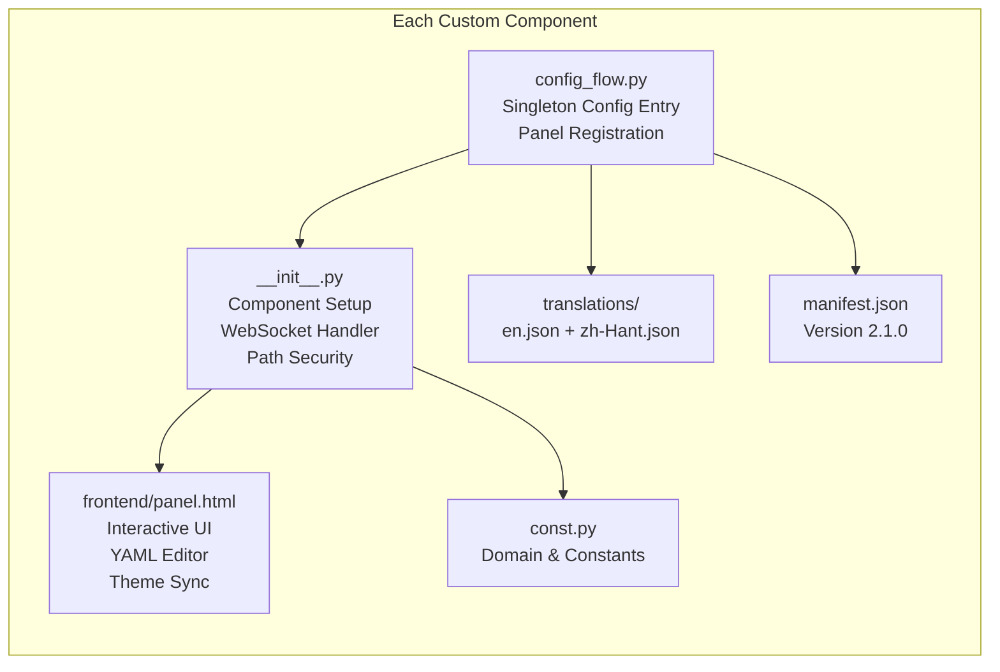
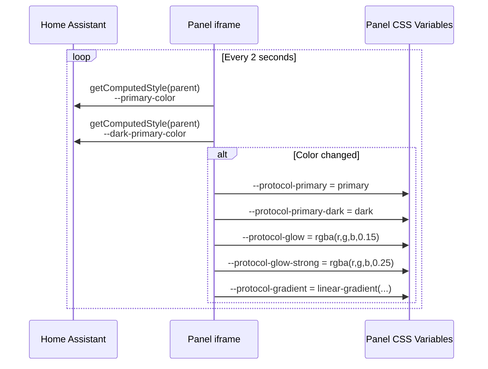
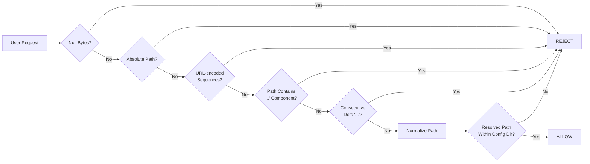

<p align="center">
  
</p>

<h1 align="center">Woow HA Multi-Protocol Connect</h1>

<p align="center">
  <strong>Enterprise-grade Multi-Protocol Setup Guide for Home Assistant</strong><br/>
  Interactive YAML configuration panels for KNX, DMX (Art-Net), and Modbus protocols
</p>

<p align="center">
  <a href="#features">Features</a> &bull;
  <a href="#architecture">Architecture</a> &bull;
  <a href="#installation">Installation</a> &bull;
  <a href="#panels">Panels</a> &bull;
  <a href="#screenshots">Screenshots</a> &bull;
  <a href="#configuration">Configuration</a> &bull;
  <a href="#security">Security</a> &bull;
  <a href="#testing">Testing</a> &bull;
  <a href="README_zh-TW.md">中文文件</a>
</p>

<p align="center">
  
  
  
  
  
  
</p>

---

## Overview

**Woow HA Multi-Protocol Connect** is a suite of three Home Assistant custom components that provide interactive, browser-based YAML configuration panels for the most widely used building automation protocols: **KNX**, **DMX (Art-Net/sACN)**, and **Modbus**. Each panel delivers a guided setup experience with a built-in YAML editor, real-time WebSocket file management, and dynamic theme synchronization with Home Assistant.

<p align="center">
  
</p>

### Why This Package?

| Challenge | Solution |
|-----------|----------|
| Protocol YAML configuration is complex and error-prone | Interactive step-by-step guided panels with syntax-aware editor |
| Switching between documentation and config files | Built-in links to official docs + integrated YAML editor in one view |
| No safe way to edit configs from the browser | WebSocket API with atomic writes, path traversal protection, and crash recovery |
| Theme inconsistency in custom panels | Dynamic theme sync — panels follow HA's primary color in real time |
| Need to support multiple building protocols | Unified architecture across KNX, DMX, and Modbus with protocol-specific customization |
| Mobile device editing support | Fully responsive UI — works on desktop, tablet, and mobile browsers |

---

## Features

### Core Capabilities

- **Three Protocol Panels** — KNX (building automation), DMX/Art-Net (lighting), Modbus (industrial) — each with protocol-specific guidance
- **Interactive YAML Editor** — Browser-based editor with syntax highlighting, tab support, font size control, and keyboard shortcuts (Ctrl+S)
- **WebSocket File Management** — Real-time list/load/save operations via HA's native WebSocket connection
- **Dynamic Theme Sync** — Panels automatically follow Home Assistant's `--primary-color` with 2-second polling
- **Dark/Light Mode** — Full support for both HA themes with automatic detection
- **Crash Recovery** — Unsaved edits cached in `localStorage` — recoverable after browser crash or accidental close
- **Internationalization** — Full English and Traditional Chinese (zh-Hant) translation support
- **Atomic File Writes** — Config saves are atomic to prevent corruption from interrupted writes
- **HA Restart Integration** — One-click Home Assistant restart with safety confirmation from within the panel

### Protocol-Specific Features

#### KNX Panel (`woow_knx`)
- KNX/IP Gateway tunneling configuration
- Group Address mapping and format guidance
- Entity types: light, switch, cover, climate, sensor, binary_sensor, scene, fan, number, select
- Comprehensive enterprise building example (3-story office with 100+ entities)

#### DMX Panel (`woow_dmx`)
- Art-Net DMX node IP and Universe settings
- Channel Mapping for lighting fixtures
- Fixture types: dimmer, rgb, rgbw, color_temp, rgbww, binary, fixed
- sACN/E1.31 configuration support

#### Modbus Panel (`woow_modbus`)
- Modbus TCP (network) and RTU (serial RS-485/RS-232)
- Slave ID configuration (1–247)
- Register types: Coil, Discrete Input, Holding Register, Input Register
- Data type conversion: int16, uint16, int32, float32, etc.
- Solar inverter monitoring example

### WebSocket API

Each component exposes a secure WebSocket API through Home Assistant:

| Action | Description | Parameters |
|--------|-------------|------------|
| `list` | List YAML files in config directory | `ext`, `depth` |
| `load` | Load file content (UTF-8) | `path` |
| `save` | Atomically write file | `path`, `content` |

---

## Architecture

### System Overview



### Component Architecture



### Theme Synchronization Flow



### WebSocket Security Pipeline



---

## Installation

### Prerequisites

- Home Assistant **2026.1.3** or later
- Admin access to your HA instance
- For KNX: KNX/IP Gateway on the network
- For DMX: [ha-artnet-led](https://github.com/corneyl/ha-artnet-led) installed via HACS
- For Modbus: Modbus TCP or RTU devices accessible

### Step 1: Copy Components

```bash
# Clone the repository
git clone https://github.com/WOOWTECH/Woow_ha_multi_protocol_connect.git

# Copy desired components to your HA custom_components directory
cp -r Woow_ha_multi_protocol_connect/custom_components/woow_knx /config/custom_components/
cp -r Woow_ha_multi_protocol_connect/custom_components/woow_dmx /config/custom_components/
cp -r Woow_ha_multi_protocol_connect/custom_components/woow_modbus /config/custom_components/
```

### Step 2: Restart Home Assistant

```bash
# Restart to pick up new components
ha core restart
```

### Step 3: Add Integrations

1. Navigate to **Settings > Devices & Services > Add Integration**
2. Search for "Woow KNX Setup Guide" (or DMX / Modbus)
3. Click to install — each component uses a singleton config flow (one instance per protocol)
4. The panel will appear in your HA sidebar automatically

### Docker / Podman Deployment

```bash
# Mount custom_components into your container
podman run -d \
  --name homeassistant \
  -v /path/to/config:/config \
  -v /path/to/Woow_ha_multi_protocol_connect/custom_components:/config/custom_components \
  -p 8123:8123 \
  ghcr.io/home-assistant/home-assistant:2026.4
```

---

## Panels

### KNX Setup Guide

Interactive guide for configuring KNX building automation — covers KNX/IP Gateway tunneling, group address mapping, and entity setup for lights, switches, covers, climate, sensors, scenes, fans, and more.

<p align="center">
  
</p>

**Key sections:**
1. Read KNX official documentation (with direct links)
2. Use AI assistant for YAML generation
3. Edit & save YAML in the built-in editor

### DMX Setup Guide

Step-by-step configuration for Art-Net and sACN lighting control — fixture type definitions, channel mapping, universe settings, and DMX node network configuration.

<p align="center">
  
</p>

**Supported fixture types:** dimmer, rgb, rgbw, color_temp, rgbww, binary, fixed

### Modbus Setup Guide

Industrial equipment integration via Modbus TCP and RTU — register mapping, data type conversion, and real-world examples for solar inverters, HVAC, and energy monitoring.

<p align="center">
  
</p>

**Supported connections:** TCP (network), RTU (RS-485/RS-232)

---

## Screenshots

### Desktop Views

| KNX Panel (Light Mode) | DMX Panel | Modbus Panel |
|:-:|:-:|:-:|
|  |  |  |

### Dark Mode

<p align="center">
  
</p>

### Mobile Views

| KNX Mobile | DMX Mobile | Modbus Mobile |
|:-:|:-:|:-:|
|  |  |  |

### YAML Editor & File Browser

| Editor with WebSocket Status | File Browser |
|:-:|:-:|
|  |  |

### Home Assistant Integration

| Sidebar with 3 Panels | Theme Settings | Integrations Page |
|:-:|:-:|:-:|
|  |  |  |

---

## Configuration

### Config Samples

This repository includes production-ready YAML configuration examples for each protocol:

#### KNX (`config_samples/knx/`)

| File | Description |
|------|-------------|
| `knx_main.yaml` | Complete 3-story office building — 100+ entities (lights, HVAC, sensors, covers, scenes) |
| `knx_automations.yaml` | Automation workflows for KNX events |
| `knx_scripts.yaml` | Script definitions for scene recall and batch control |

#### DMX (`config_samples/dmx/`)

| File | Description |
|------|-------------|
| `dmx_artnet.yaml` | Art-Net node configuration template |
| `dmx_sacn.yaml` | sACN/E1.31 configuration template |
| `dmx_fixtures.yaml` | Fixture definitions for all supported types |
| `dmx_scenes.yaml` | DMX scene definitions and memory recalls |

#### Modbus (`config_samples/modbus/`)

| File | Description |
|------|-------------|
| `modbus_tcp.yaml` | TCP connection configuration |
| `modbus_rtu.yaml` | RTU serial port configuration |
| `modbus_solar.yaml` | Solar inverter monitoring example |
| `modbus_automations.yaml` | Modbus-triggered automation rules |

### Panel UI Configuration

Each panel's YAML editor supports:

- **File depth limiting** — Control how deep the file browser scans (default: 10 levels)
- **Font size** — Adjust editor font with A-/A+ buttons (persisted in localStorage)
- **Keyboard shortcuts** — `Ctrl+S` / `Cmd+S` to save, `Tab` for 2-space indent
- **New file creation** — Create new YAML files directly from the panel
- **WebSocket auto-reconnect** — 5-second backoff on connection loss

---

## Security

### Path Traversal Protection

All three components implement a hardened 7-layer path sanitization pipeline:

```
1. Reject null bytes (\x00)
2. Reject absolute paths (/ or \)
3. Reject URL-encoded sequences (%2e, %2f, etc.)
4. Normalize backslashes to forward slashes
5. Reject '..' as any path component
6. Reject consecutive dots (...)
7. Verify resolved path is within config directory (real path check)
```

### Security Features

| Feature | Description |
|---------|-------------|
| **Path Sanitization** | 7-layer pipeline preventing directory traversal attacks |
| **Admin-Only Access** | Panels require HA administrator authentication |
| **Atomic Writes** | File saves are atomic — no partial writes on crash |
| **WebSocket Auth** | All API calls authenticated through HA's native WebSocket token |
| **Directory Isolation** | Each component reads/writes only within its own config directory |
| **Symlink Protection** | Resolved real paths prevent symlink escape attacks |
| **Input Validation** | All user-supplied paths validated before filesystem access |

### Vulnerability Disclosure

A critical path traversal vulnerability was discovered and fixed during development:

**Before (vulnerable):**
```python
# Bypassable with ....// → becomes ../ after stripping
sanitized = raw.replace("../", "").replace("..\\", "")
```

**After (hardened):**
```python
# Reject '..' as ANY path component — not bypassable
parts = normalized.split("/")
if any(p == ".." for p in parts):
    raise ValueError("Path traversal rejected")
# + 6 additional validation layers
```

Full details in the [test suite](tests/) and [PRD](PRD.md).

---

## Testing

### Test Coverage Summary

This project has undergone comprehensive enterprise-grade testing:

| Suite | Tests | Pass Rate | Coverage |
|-------|-------|-----------|----------|
| **Enterprise Integration** | 175 | 100% | Deployment, WebSocket API, Security, Edge Cases, Frontend, Isolation, Restart, Logging, Regression |
| **Theme Sync (Playwright)** | 16 | 100% | Color sync, dark mode, cross-panel consistency, navigation stability |
| **Total** | **191** | **100%** | Full stack coverage |

### Enterprise Integration Test (175 tests)

| Phase | Tests | Description |
|-------|-------|-------------|
| 1. Deployment Lifecycle | 11 | Component installation, config entry, panel registration |
| 2. WebSocket Backend API | 36 | List/load/save operations, error handling |
| 3. Security Boundaries | 34 | Path traversal, permission enforcement, injection prevention |
| 4. Edge Cases & Stress | 8 | Large files, concurrent access, malformed input |
| 5. Frontend Panel | 57 | UI rendering, theme sync, editor functionality |
| 6. Cross-Component Isolation | 11 | Three-protocol independence verification |
| 7. HA Restart Resilience | 11 | Component survival across HA restarts |
| 8. Log & Error Handling | 4 | Proper logging and error reporting |
| 9. Multi-Round Regression | 3 | Stability across repeated test cycles |

### Playwright Theme Sync Test (16 tests)

| Group | Tests | Description |
|-------|-------|-------------|
| 1. Basic Sync | 4 | Initial render, color change follow, all 5 CSS vars, sequential changes |
| 2. Color Parsing | 4 | Black/white/red edge values, dark-primary-color fallback |
| 3. Dark Mode | 2 | Dark mode sync, dark-to-light switch without residual color |
| 4. Stability | 3 | 3-second SLA, rapid 5x changes, navigate away/back |
| 5. Cross-Panel | 3 | All 3 panels identical colors, visual hero backgrounds match |

### Running Tests

```bash
# Enterprise integration tests
python test_enterprise.py

# Playwright theme sync tests
cd tests/theme-sync
npm install
node_modules/.bin/playwright test --config=playwright.config.ts
```

### Protocol Simulators

Three standalone Python simulators enable testing without physical hardware:

```bash
# Create virtual environment
python -m venv sim_venv
source sim_venv/bin/activate
pip install pyknx pymodbus

# Run simulators
python simulators/knx_simulator.py
python simulators/dmx_artnet_simulator.py
python simulators/modbus_simulator.py
```

---

## Project Structure

```
Woow_ha_multi_protocol_connect/
├── custom_components/              # HA custom component packages
│   ├── woow_knx/                  # KNX Setup Guide
│   │   ├── __init__.py            # Component + WebSocket handler
│   │   ├── config_flow.py         # Singleton config flow
│   │   ├── const.py               # Constants
│   │   ├── manifest.json          # v2.1.0
│   │   ├── strings.json           # Default strings
│   │   ├── frontend/
│   │   │   └── panel.html         # Interactive UI (1600+ lines)
│   │   └── translations/
│   │       ├── en.json            # English
│   │       └── zh-Hant.json       # Traditional Chinese
│   ├── woow_dmx/                  # DMX Setup Guide (same structure)
│   └── woow_modbus/               # Modbus Setup Guide (same structure)
│
├── config_samples/                 # Production-ready YAML examples
│   ├── knx/                       # KNX configs (3-story office)
│   ├── dmx/                       # DMX/Art-Net/sACN configs
│   └── modbus/                    # Modbus TCP/RTU configs
│
├── simulators/                     # Protocol simulators for testing
│   ├── knx_simulator.py           # KNX/IP tunneling emulator
│   ├── dmx_artnet_simulator.py    # Art-Net DMX emulator
│   └── modbus_simulator.py        # Modbus TCP/RTU emulator
│
├── tests/                          # Test suites
│   └── theme-sync/                # Playwright browser automation tests
│       ├── playwright.config.ts   # Test configuration
│       ├── helpers.ts             # Shared test utilities
│       └── theme-sync.spec.ts     # 16 test cases across 5 groups
│
├── test_enterprise.py              # Enterprise integration tests (175 cases)
├── test_integration_deploy.py      # Deployment verification tests
├── test_directory_isolation.py     # Security boundary tests
├── PRD.md                          # Product Requirements Document
├── README.md                       # English documentation (this file)
├── README_zh-TW.md                 # Traditional Chinese documentation
└── docs/
    └── screenshots/               # Documentation screenshots
```

---

## Changelog

### v2.1.0 (2026-04)

- **Feature:** Dynamic theme synchronization — panels follow HA's `--primary-color` in real time via 2-second polling
- **Feature:** Full dark/light mode support with automatic detection
- **Security:** Hardened 7-layer path sanitization pipeline replacing vulnerable single-pass stripping
- **Testing:** Playwright browser automation test suite — 16 tests across 5 groups (color sync, dark mode, cross-panel, stability)
- **Testing:** Enterprise integration test — 175 tests across 9 phases (100% pass rate)
- **UI:** Responsive design improvements for mobile and tablet
- **UI:** Crash recovery via localStorage for unsaved editor changes
- **i18n:** Complete English and Traditional Chinese translations

### v2.0.0 (2026-03)

- **Feature:** Three unified protocol panels (KNX, DMX, Modbus)
- **Feature:** WebSocket-based YAML editor with list/load/save
- **Feature:** Singleton config flow (one panel per protocol)
- **Feature:** HA restart integration from within panel
- **Security:** Path traversal protection and admin-only access
- **Samples:** Production-ready config examples for all protocols

---

## Support

- **Website:** [https://aiot.woowtech.io](https://aiot.woowtech.io)
- **Blog:** [https://aiot.woowtech.io/blog](https://aiot.woowtech.io/blog)
- **Issues:** [GitHub Issues](https://github.com/WOOWTECH/Woow_ha_multi_protocol_connect/issues)

---

## License

This project is licensed under the **MIT License**.

---

<p align="center">
  <sub>Built with care by <a href="https://github.com/WOOWTECH">WOOWTECH</a> &bull; Powered by Home Assistant</sub>
</p>
