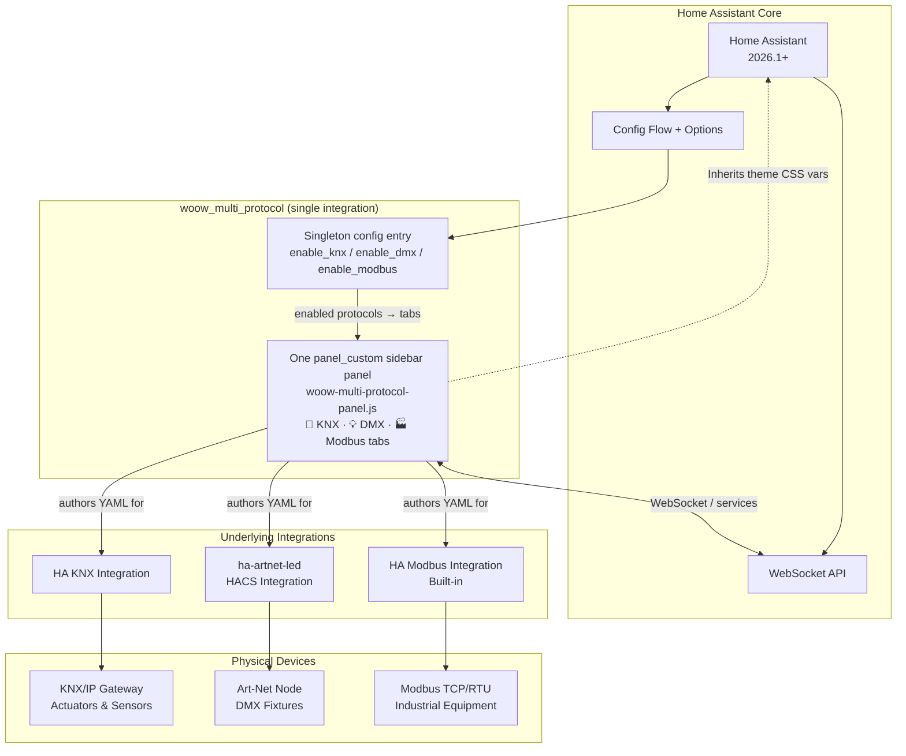
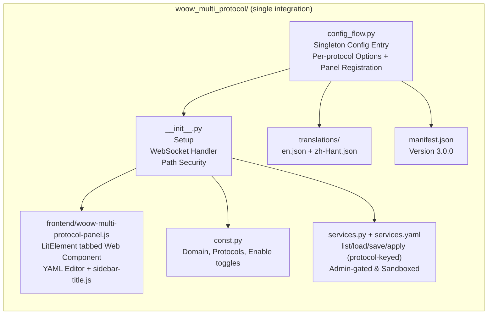
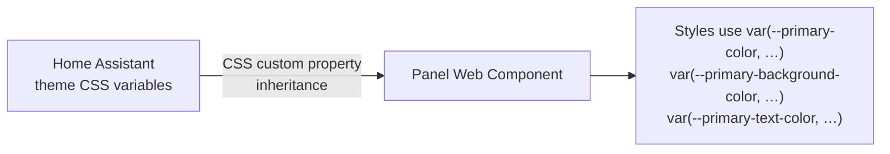
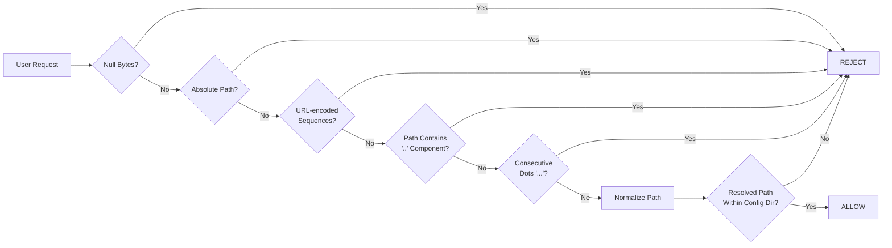

<p align="center">
  
</p>

<h1 align="center">Woow HA Multi-Protocol Connect</h1>

<p align="center">
  <strong>Enterprise-grade Multi-Protocol Setup Guide for Home Assistant</strong><br/>
  Interactive YAML configuration panels for KNX, DMX (Art-Net), and Modbus protocols
</p>

<p align="center">
  <a href="#features">Features</a> &bull;
  <a href="#architecture">Architecture</a> &bull;
  <a href="#installation">Installation</a> &bull;
  <a href="#panels">Panels</a> &bull;
  <a href="#screenshots">Screenshots</a> &bull;
  <a href="#configuration">Configuration</a> &bull;
  <a href="#security">Security</a> &bull;
  <a href="#testing">Testing</a> &bull;
  <a href="README_zh-TW.md">中文文件</a>
</p>

<p align="center">
  
  
  
  
  
  
</p>

---

## Overview

**Woow Multi-Protocol Connect** is a single Home Assistant custom integration (domain `woow_multi_protocol`) that provides interactive, browser-based YAML configuration panels for the most widely used building automation protocols: **KNX**, **DMX (Art-Net/sACN)**, and **Modbus**. One sidebar panel presents the enabled protocols as tabs, each delivering a guided setup experience with a built-in YAML editor, real-time WebSocket file management, and dynamic theme synchronization with Home Assistant. Which protocols appear is controlled from the integration's **Options** flow.

<p align="center">
  
</p>

### Why This Package?

| Challenge | Solution |
|-----------|----------|
| Protocol YAML configuration is complex and error-prone | Interactive step-by-step guided panels with syntax-aware editor |
| Switching between documentation and config files | Built-in links to official docs + integrated YAML editor in one view |
| No safe way to edit configs from the browser | WebSocket API with atomic writes, path traversal protection, and crash recovery |
| Theme inconsistency in custom panels | Dynamic theme sync — panels follow HA's primary color in real time |
| Need to support multiple building protocols | Unified architecture across KNX, DMX, and Modbus with protocol-specific customization |
| Mobile device editing support | Fully responsive UI — works on desktop, tablet, and mobile browsers |

---

## Features

### Core Capabilities

- **Three Protocol Panels** — KNX (building automation), DMX/Art-Net (lighting), Modbus (industrial) — each with protocol-specific guidance
- **Interactive YAML Editor** — Browser-based editor with syntax highlighting, tab support, font size control, and keyboard shortcuts (Ctrl+S)
- **WebSocket File Management** — Real-time list/load/save operations via HA's native WebSocket connection
- **Service Layer** — A single service set (`list_files`, `load_file`, `save_file`, `apply`), each taking a required `protocol` field, exposed as Home Assistant services (admin-gated, sandboxed per protocol) — callable from automations, scripts, and Developer Tools
- **Native Theme Inheritance** — Panels are LitElement `panel_custom` Web Components that inherit HA's theme CSS variables (`--primary-color`, etc.) directly — colors and dark/light mode follow HA instantly, no iframe or polling
- **Dark/Light Mode** — Full support for both HA themes with automatic detection
- **Crash Recovery** — Unsaved edits cached in `localStorage` — recoverable after browser crash or accidental close
- **Internationalization** — Full English and Traditional Chinese (zh-Hant) translation support
- **Atomic File Writes** — Config saves are atomic to prevent corruption from interrupted writes
- **HA Restart Integration** — One-click Home Assistant restart with safety confirmation from within the panel

### Protocol-Specific Features

#### KNX Panel (`woow_knx`)
- KNX/IP Gateway tunneling configuration
- Group Address mapping and format guidance
- Entity types: light, switch, cover, climate, sensor, binary_sensor, scene, fan, number, select
- Comprehensive enterprise building example (3-story office with 100+ entities)

#### DMX Panel (`woow_dmx`)
- Art-Net DMX node IP and Universe settings
- Channel Mapping for lighting fixtures
- Fixture types: dimmer, rgb, rgbw, color_temp, rgbww, binary, fixed
- sACN/E1.31 configuration support

#### Modbus Panel (`woow_modbus`)
- Modbus TCP (network) and RTU (serial RS-485/RS-232)
- Slave ID configuration (1–247)
- Register types: Coil, Discrete Input, Holding Register, Input Register
- Data type conversion: int16, uint16, int32, float32, etc.
- Solar inverter monitoring example

### WebSocket API

The integration exposes a secure WebSocket API through Home Assistant:

| Action | Description | Parameters |
|--------|-------------|------------|
| `list` | List YAML files in config directory | `ext`, `depth` |
| `load` | Load file content (UTF-8) | `path` |
| `save` | Atomically write file | `path`, `content` |

### Service API

The same file operations are exposed as Home Assistant services under the single
`woow_multi_protocol` domain. Every call takes a required `protocol: knx | dmx | modbus`
field and is sandboxed to `<config>/woow_multi_protocol/<protocol>/`, admin-gated
(see [ADR-0002](docs/adr/0002-apply-reload-semantics.md)):

| Service | Description | Fields |
|---------|-------------|--------|
| `woow_multi_protocol.list_files` | List config files in the protocol subdirectory | `protocol`, `ext`, `depth` |
| `woow_multi_protocol.load_file` | Read a UTF-8 file (returns `content`, `path`) | `protocol`, `path` |
| `woow_multi_protocol.save_file` | Atomically write a file (write only) | `protocol`, `path`, `content` |
| `woow_multi_protocol.apply` | Reload the underlying integration so saved config takes effect; reports `restart_required` without restarting unless `force_restart` is set | `protocol`, `force_restart` |

---

## Architecture

### System Overview



### Component Architecture



> The panel Web Component is built from the repo-root `panel_frontend/` workspace (Lit + Rollup) and deployed into the integration's `frontend/` directory. The workspace lives outside `custom_components/`, so HACS ships only the `woow_multi_protocol` folder.

### Theme Inheritance

Because the panels are `panel_custom` Web Components rendered inside the HA frontend (not sandboxed iframes), they inherit Home Assistant's theme CSS custom properties directly through the DOM. Panel styles reference HA variables such as `--primary-color`, `--primary-background-color`, and `--primary-text-color` with sensible fallbacks — so color changes and dark/light mode switches apply instantly, with no polling or manual color parsing.



### WebSocket Security Pipeline



---

## Installation

Woow Multi-Protocol Connect ships as **one** Home Assistant integration
(`woow_multi_protocol`) and installs as a **HACS custom repository**.

### Prerequisites

- Home Assistant **2026.1.0** or later
- [HACS](https://hacs.xyz) installed and set up
- Admin access to your HA instance
- For KNX: KNX/IP Gateway on the network
- For DMX: [ha-artnet-led](https://github.com/corneyl/ha-artnet-led) installed via HACS
- For Modbus: Modbus TCP or RTU devices accessible

### Step 1: Add the custom repository to HACS

1. In Home Assistant, open **HACS**.
2. Click the **⋮** menu (top-right) → **Custom repositories**.
3. Add the repository URL and choose the **Integration** category:
   - **Repository:** `https://github.com/WOOWTECH/Woow_ha_multi_protocol_connect`
   - **Category:** `Integration`
4. Click **Add**. "Woow Multi-Protocol Connect" now appears in HACS.

### Step 2: Download and restart

1. Open **Woow Multi-Protocol Connect** in HACS and click **Download**.
2. **Restart Home Assistant** when prompted so the integration is loaded.

### Step 3: Add the integration

1. Navigate to **Settings → Devices & Services → Add Integration**.
2. Search for **Woow Multi-Protocol Connect** and select it.
3. Click **Submit** — a single, singleton config entry is created (only one
   instance is ever added).
4. The **Woow Multi-Protocol Connect** panel appears in your HA sidebar with a tab
   per enabled protocol.

### Step 4: Choose which protocols to show (Options)

The panel shows **all three protocols by default**. To hide the ones you don't
use:

1. Go to **Settings → Devices & Services → Woow Multi-Protocol Connect → Configure**.
2. Toggle **Enable KNX**, **Enable DMX**, and **Enable Modbus** as needed.
3. Save — the entry reloads and the panel's tabs are rebuilt to match. At least
   one protocol should stay enabled for the panel to be useful.

The same toggles gate the service layer: a `protocol` you disable is no longer
selectable from the panel, though the sandbox directory under
`<config>/woow_multi_protocol/<protocol>/` is left untouched.

### Manual install (without HACS)

Prefer not to use HACS? Copy the single integration folder into your config:

```bash
git clone https://github.com/WOOWTECH/Woow_ha_multi_protocol_connect.git
cp -r Woow_ha_multi_protocol_connect/custom_components/woow_multi_protocol /config/custom_components/
# then restart Home Assistant and add the integration as in Step 3
```

### Upgrading from the old `woow_knx` / `woow_dmx` / `woow_modbus` integrations

> **Clean break — no automatic migration.** Version 3.0.0 merges the three former
> integrations (`woow_knx`, `woow_dmx`, `woow_modbus`) into this single
> `woow_multi_protocol` integration. Home Assistant cannot migrate config entries
> across domains, so the old entries, services (`woow_knx.*`, …), and sandbox
> paths do **not** carry over. This is intentional and gated behind the major
> version bump.

To upgrade:

1. **Back up** any YAML you edited through the old panels — it lives under
   `<config>/woow_knx/`, `<config>/woow_dmx/`, and `<config>/woow_modbus/`.
2. **Remove** the old integrations: delete their entries in **Settings → Devices &
   Services**, then remove the `custom_components/woow_knx`,
   `custom_components/woow_dmx`, and `custom_components/woow_modbus` folders (or
   uninstall them from HACS if you added them separately).
3. **Restart** Home Assistant.
4. **Install** Woow Multi-Protocol Connect (Steps 1–3 above).
5. **Move your YAML** into the new per-protocol sandboxes at
   `<config>/woow_multi_protocol/knx/`, `.../dmx/`, and `.../modbus/`, then use the
   panel or the `woow_multi_protocol.*` services to load and apply it.

### Docker / Podman deployment

For a manual (non-HACS) install, mount the single integration folder into the
container's `custom_components`:

```bash
podman run -d \
  --name homeassistant \
  -v /path/to/config:/config \
  -v /path/to/Woow_ha_multi_protocol_connect/custom_components/woow_multi_protocol:/config/custom_components/woow_multi_protocol \
  -p 8123:8123 \
  ghcr.io/home-assistant/home-assistant:2026.4
```

---

## Panels

### KNX Setup Guide

Interactive guide for configuring KNX building automation — covers KNX/IP Gateway tunneling, group address mapping, and entity setup for lights, switches, covers, climate, sensors, scenes, fans, and more.

<p align="center">
  
</p>

**Key sections:**
1. Read KNX official documentation (with direct links)
2. Use AI assistant for YAML generation
3. Edit & save YAML in the built-in editor

### DMX Setup Guide

Step-by-step configuration for Art-Net and sACN lighting control — fixture type definitions, channel mapping, universe settings, and DMX node network configuration.

<p align="center">
  
</p>

**Supported fixture types:** dimmer, rgb, rgbw, color_temp, rgbww, binary, fixed

### Modbus Setup Guide

Industrial equipment integration via Modbus TCP and RTU — register mapping, data type conversion, and real-world examples for solar inverters, HVAC, and energy monitoring.

<p align="center">
  
</p>

**Supported connections:** TCP (network), RTU (RS-485/RS-232)

---

## Screenshots

### Desktop Views

| KNX Panel (Light Mode) | DMX Panel | Modbus Panel |
|:-:|:-:|:-:|
|  |  |  |

### Dark Mode

<p align="center">
  
</p>

### Mobile Views

| KNX Mobile | DMX Mobile | Modbus Mobile |
|:-:|:-:|:-:|
|  |  |  |

### YAML Editor & File Browser

| Editor with WebSocket Status | File Browser |
|:-:|:-:|
|  |  |

### Home Assistant Integration

| Sidebar with 3 Panels | Theme Settings | Integrations Page |
|:-:|:-:|:-:|
|  |  |  |

---

## Configuration

### Config Samples

This repository includes production-ready YAML configuration examples for each protocol:

#### KNX (`config_samples/knx/`)

| File | Description |
|------|-------------|
| `knx_main.yaml` | Complete 3-story office building — 100+ entities (lights, HVAC, sensors, covers, scenes) |
| `knx_automations.yaml` | Automation workflows for KNX events |
| `knx_scripts.yaml` | Script definitions for scene recall and batch control |

#### DMX (`config_samples/dmx/`)

| File | Description |
|------|-------------|
| `dmx_artnet.yaml` | Art-Net node configuration template |
| `dmx_sacn.yaml` | sACN/E1.31 configuration template |
| `dmx_fixtures.yaml` | Fixture definitions for all supported types |
| `dmx_scenes.yaml` | DMX scene definitions and memory recalls |

#### Modbus (`config_samples/modbus/`)

| File | Description |
|------|-------------|
| `modbus_tcp.yaml` | TCP connection configuration |
| `modbus_rtu.yaml` | RTU serial port configuration |
| `modbus_solar.yaml` | Solar inverter monitoring example |
| `modbus_automations.yaml` | Modbus-triggered automation rules |

### Panel UI Configuration

Each panel's YAML editor supports:

- **File depth limiting** — Control how deep the file browser scans (default: 10 levels)
- **Font size** — Adjust editor font with A-/A+ buttons (persisted in localStorage)
- **Keyboard shortcuts** — `Ctrl+S` / `Cmd+S` to save, `Tab` for 2-space indent
- **New file creation** — Create new YAML files directly from the panel
- **WebSocket auto-reconnect** — 5-second backoff on connection loss

---

## Security

### Path Traversal Protection

Every file operation runs through a hardened 7-layer path sanitization pipeline:

```
1. Reject null bytes (\x00)
2. Reject absolute paths (/ or \)
3. Reject URL-encoded sequences (%2e, %2f, etc.)
4. Normalize backslashes to forward slashes
5. Reject '..' as any path component
6. Reject consecutive dots (...)
7. Verify resolved path is within config directory (real path check)
```

### Security Features

| Feature | Description |
|---------|-------------|
| **Path Sanitization** | 7-layer pipeline preventing directory traversal attacks |
| **Admin-Gated Backend** | The file-editing WebSocket commands and services require an HA administrator; all filesystem access is admin-only |
| **Atomic Writes** | File saves are atomic — no partial writes on crash |
| **WebSocket Auth** | All API calls authenticated through HA's native WebSocket token |
| **Directory Isolation** | Each protocol reads/writes only within its own `<config>/woow_multi_protocol/<protocol>/` sandbox |
| **Symlink Protection** | Resolved real paths prevent symlink escape attacks |
| **Input Validation** | All user-supplied paths validated before filesystem access |

### Vulnerability Disclosure

A critical path traversal vulnerability was discovered and fixed during development:

**Before (vulnerable):**
```python
# Bypassable with ....// → becomes ../ after stripping
sanitized = raw.replace("../", "").replace("..\\", "")
```

**After (hardened):**
```python
# Reject '..' as ANY path component — not bypassable
parts = normalized.split("/")
if any(p == ".." for p in parts):
    raise ValueError("Path traversal rejected")
# + 6 additional validation layers
```

Full details in the [test suite](tests/), the [test plan](docs/testing/test-plan.md), and [ADR-0001](docs/adr/0001-reject-dotdot-path-components.md).

---

## Testing

### Test Coverage Summary

This project has undergone comprehensive enterprise-grade testing. Tests fall into two categories: a **hermetic** suite that runs automatically in CI (no external dependencies), and **live/opt-in** suites that require a running Home Assistant instance or a browser.

| Suite | Tests | Environment | Pass Rate | Coverage |
|-------|-------|-------------|-----------|----------|
| **Service layer (hermetic)** | 14 | CI (`pytest`) | 100% | Admin gating, sandbox boundaries, file operations, apply/reload semantics |
| **Config & panel seam (hermetic)** | 14 | CI (`pytest`) | 100% | Singleton config flow, per-protocol enable toggles, panel registration |
| **Hermetic total (CI)** | **28** | CI (`pytest`) | **100%** | `tests/services` + `tests/config` |
| **Enterprise integration** | 10 phases | Live HA (opt-in) | 100% | Deployment, WebSocket API, security, edge cases, frontend, options→tabs, cross-protocol isolation, restart, logging/regression, service layer |
| **Theme sync (Playwright)** | 12 | Browser (opt-in) | 100% | Panel structure (tabs), color/theme sync, dark-mode & background readiness |

> CI (`.github/workflows/ci.yml`) runs ruff lint, hassfest manifest validation, the **28 hermetic tests** (`tests/services` + `tests/config`, scoped by `pytest.ini`), and the frontend build on every push and PR. The live enterprise and Playwright suites are opt-in and are **not** run in CI. The enterprise suite's last frozen full run scored **175/175** (v2.0.0, 9 phases — see [`docs/testing/2026-04-10-test-report.md`](docs/testing/2026-04-10-test-report.md)); the merged integration adds a 10th service-layer phase.

### Enterprise integration suite (`tests/live/live_enterprise.py`)

Ten phases against a live Home Assistant. The per-phase counts below are from the
last frozen full run (v2.0.0, **175/175** — see the
[dated report](docs/testing/2026-04-10-test-report.md)); Phase 10 was added with
the service layer in v3.0.0.

| Phase | Tests | Description |
|-------|-------|-------------|
| 1. Deployment lifecycle | 11 | Component install, singleton config entry, panel registration |
| 2. WebSocket backend API | 36 | List/load/save operations, error handling |
| 3. Security boundaries | 34 | Path traversal, permission enforcement, injection prevention |
| 4. Edge cases & stress | 8 | Large files, concurrent access, malformed input |
| 5. Frontend panel | 57 | Single tabbed bundle — rendering, theme sync, editor functionality |
| 6. Options → tabs + cross-protocol isolation | 11 | Enabled protocols drive the tabs; each protocol sees only its own sandbox |
| 7. HA restart resilience | 11 | Panel and API survive HA restarts |
| 8. Log & error handling | 4 | Proper logging and error reporting |
| 9. Multi-round regression & soak | 3 | Stability across repeated test cycles |
| 10. Service layer *(new in v3.0.0)* | — | `list_files` / `load_file` / `save_file` / `apply` over REST — admin gating, sandbox, apply contract |

### Playwright panel & theme-sync suite (`tests/theme-sync/`, 12 tests)

| Group | Tests | Description |
|-------|-------|-------------|
| 1. Panel structure | 4 | Tabs equal the enabled protocols, first tab active on load, clicking activates a tab, exactly one active at a time |
| 2. Theme sync | 5 | Primary color on initial render, follows HA color changes, `--primary-color` reaches the panel, sequential changes settle, color persists across a tab switch |
| 3. Background / dark-mode readiness | 3 | Panel background matches `--primary-background-color`, follows a background-variable change, still follows the primary color while the background is dark |

### Running Tests

```bash
# Hermetic tests (no external dependencies; this is what CI runs)
pip install -r requirements-test.txt
pytest                       # testpaths = tests/services tests/config (see pytest.ini)

# Enterprise integration tests (standalone; needs a live HA)
python tests/live/live_enterprise.py

# Playwright theme sync tests
cd tests/theme-sync
npm install
node_modules/.bin/playwright test --config=playwright.config.ts
```

### Protocol Simulators

Three standalone Python simulators enable testing without physical hardware:

```bash
# Create virtual environment
python -m venv sim_venv
source sim_venv/bin/activate
pip install -r simulators/requirements.txt

# Run simulators
python simulators/knx_simulator.py
python simulators/dmx_artnet_simulator.py
python simulators/modbus_simulator.py
```

---

## Project Structure

```
Woow_ha_multi_protocol_connect/
├── custom_components/              # HA custom component packages (exactly one)
│   └── woow_multi_protocol/        # The single merged integration
│       ├── __init__.py            # Setup + WebSocket handler + path security
│       ├── config_flow.py         # Singleton config flow + per-protocol Options
│       ├── const.py               # Domain, protocols, enable-toggle helpers
│       ├── services.py            # Service layer (list/load/save/apply, protocol-keyed)
│       ├── services.yaml          # Service definitions (Developer Tools UI)
│       ├── manifest.json          # v3.0.0
│       ├── strings.json           # Config + Options strings
│       ├── brand/                 # WOOWTECH icon/logo assets (one set)
│       ├── frontend/
│       │   ├── woow-multi-protocol-panel.js  # LitElement tabbed panel bundle
│       │   └── sidebar-title.js   # Sidebar title rendering
│       └── translations/
│           ├── en.json            # English
│           └── zh-Hant.json       # Traditional Chinese
│
├── panel_frontend/                 # Panel build workspace (Lit + Rollup), repo-root
│   ├── package.json               # Build tooling & lit dependency
│   ├── rollup.config.js           # Bundler config
│   ├── scripts/deploy.js          # Copies the built bundle into the integration
│   └── src/                        # Tabbed shell, per-protocol config, styles, i18n
│
├── config_samples/                 # Production-ready YAML examples
│   ├── knx/                       # KNX configs (3-story office)
│   ├── dmx/                       # DMX/Art-Net/sACN configs
│   └── modbus/                    # Modbus TCP/RTU configs
│
├── simulators/                     # Protocol simulators for testing
│   ├── knx_simulator.py           # KNX/IP tunneling emulator
│   ├── dmx_artnet_simulator.py    # Art-Net DMX emulator
│   ├── modbus_simulator.py        # Modbus TCP/RTU emulator
│   └── requirements.txt           # Simulator dependencies
│
├── tests/                          # Test suites
│   ├── services/                  # Hermetic Service-layer unit tests (run in CI)
│   │   ├── conftest.py
│   │   ├── test_admin_gating.py         # Admin-only enforcement
│   │   ├── test_apply_semantics.py      # apply / reload / restart behaviour
│   │   ├── test_file_operations.py      # list/load/save operations
│   │   └── test_sandbox_boundary.py     # Per-protocol sandbox isolation
│   ├── config/                    # Hermetic config/setup-seam tests (run in CI)
│   │   ├── conftest.py
│   │   ├── test_config_flow.py          # Singleton config flow
│   │   ├── test_options_flow.py         # Per-protocol enable toggles
│   │   └── test_panel_registration.py   # Panel registration
│   ├── theme-sync/                # Playwright browser automation tests
│   │   ├── playwright.config.ts   # Test configuration
│   │   ├── helpers.ts             # Shared test utilities
│   │   └── theme-sync.spec.ts     # 12 test cases across 3 groups
│   ├── live/                      # Standalone live-integration scripts (opt-in)
│   │   ├── live_enterprise.py            # Enterprise integration tests
│   │   ├── live_integration_deploy.py    # Deployment verification tests
│   │   ├── live_directory_isolation.py   # Security boundary tests
│   │   └── live_simulators.py            # Live protocol tests vs simulators
│   └── e2e-panels.sh              # End-to-end panel test runner
│
├── .github/workflows/             # CI (ci.yml) + release (release.yml)
├── docs/
│   ├── adr/                       # Architecture decision records
│   ├── agents/                    # Agent guides (issue tracker, triage, domain)
│   ├── plans/                     # Design/implementation plans
│   ├── testing/                   # Test plan + dated test reports
│   └── screenshots/              # Documentation screenshots
├── hacs.json                       # HACS metadata
├── pytest.ini                      # Test config (testpaths = tests/services tests/config)
├── ruff.toml                       # Lint config
├── requirements-test.txt           # Test dependencies
├── CLAUDE.md / CONTEXT.md          # Project + domain instructions for agents
├── README.md                       # English documentation (this file)
└── README_zh-TW.md                 # Traditional Chinese documentation
```

---

## Changelog

### v3.0.0 (2026-08) — Single HACS integration

> **Breaking change.** The three separate integrations (`woow_knx`, `woow_dmx`,
> `woow_modbus`) are merged into one integration, `woow_multi_protocol`. There is
> no automatic migration — see the [upgrade note](#upgrading-from-the-old-woow_knx--woow_dmx--woow_modbus-integrations).

- **Merge:** One integration, one domain (`woow_multi_protocol`), one singleton
  config entry, and one sidebar panel with a tab per protocol (see [ADR-0003](docs/adr/0003-merge-into-single-hacs-integration.md))
- **HACS:** The repository is now a valid HACS **custom repository** — exactly one
  folder under `custom_components/`; the Lit/Rollup build workspace moved to the
  repo-root `panel_frontend/`
- **Options flow:** Per-protocol enable toggles (`enable_knx` / `enable_dmx` /
  `enable_modbus`, all default on); saving reloads the entry and rebuilds the panel tabs
- **Services:** A single service set — `woow_multi_protocol.{list_files, load_file,
  save_file, apply}` — each taking a required `protocol` field, admin-gated and
  sandboxed to `<config>/woow_multi_protocol/<protocol>/`
- **Metadata:** `manifest.json` → name "Woow Multi-Protocol Connect", `version 3.0.0`,
  `iot_class: calculated`, `documentation`/`issue_tracker` pointed at this repo, a
  single `brand/` icon + logo; `hacs.json` finalized (no `zip_release`)
- **Security & apply semantics preserved:** the 7-layer path guard ([ADR-0001](docs/adr/0001-reject-dotdot-path-components.md))
  and restart-averse `apply` contract ([ADR-0002](docs/adr/0002-apply-reload-semantics.md))
  now key off `protocol` instead of domain
- **Testing:** added a hermetic config/options/panel suite (`tests/config`, 14 tests)
  alongside the service suite — CI now runs **28 hermetic tests**; the live enterprise
  suite gained a 10th service-layer phase, and the Playwright suite was refocused on
  panel structure + theme sync (12 tests across 3 groups)

### v2.2.0 (2026-08)

- **Feature:** Service layer — each integration now exposes `list_files`, `load_file`, `save_file`, and `apply` as Home Assistant services, callable from automations, scripts, and Developer Tools
- **Security:** Services are admin-gated and sandboxed to their protocol's config subdirectory (see ADR-0002)
- **Testing:** Hermetic service test suite — admin gating, sandbox boundaries, file operations, and apply/reload semantics
- **Testing:** Live protocol tests against KNX, DMX, and Modbus simulators
- **Internal:** GitHub Actions CI — ruff lint, hassfest validation, Python tests, frontend build
- **Docs:** Agent guides, project instructions, and architecture decision records (ADR-0001 path handling, ADR-0002 apply/reload semantics)

### v2.1.1 (2026-06)

- **Feature:** Panels rebuilt as LitElement `panel_custom` Web Components, replacing the previous iframe embedding
- **Fix:** Black screen on panel load
- **Fix:** `module_url` isolation preventing JavaScript scope collisions when multiple panels are loaded
- **UI:** Sidebar title rendering reworked with a 3-phase approach
- **Branding:** WOOWTECH icon and logo assets for all three integrations

### v2.1.0 (2026-04)

- **Feature:** Dynamic theme synchronization — panels follow HA's `--primary-color` in real time via 2-second polling
- **Feature:** Full dark/light mode support with automatic detection
- **Security:** Hardened 7-layer path sanitization pipeline replacing vulnerable single-pass stripping
- **Testing:** Playwright browser automation test suite — 16 tests across 5 groups (color sync, dark mode, cross-panel, stability)
- **Testing:** Enterprise integration test — 175 tests across 9 phases (100% pass rate)
- **UI:** Responsive design improvements for mobile and tablet
- **UI:** Crash recovery via localStorage for unsaved editor changes
- **i18n:** Complete English and Traditional Chinese translations

### v2.0.0 (2026-03)

- **Feature:** Three unified protocol panels (KNX, DMX, Modbus)
- **Feature:** WebSocket-based YAML editor with list/load/save
- **Feature:** Singleton config flow (one panel per protocol)
- **Feature:** HA restart integration from within panel
- **Security:** Path traversal protection and admin-only access
- **Samples:** Production-ready config examples for all protocols

---

## Support

- **Website:** [https://aiot.woowtech.io](https://aiot.woowtech.io)
- **Blog:** [https://aiot.woowtech.io/blog](https://aiot.woowtech.io/blog)
- **Issues:** [GitHub Issues](https://github.com/WOOWTECH/Woow_ha_multi_protocol_connect/issues)

---

## License

This project is licensed under the **MIT License**.

---

<p align="center">
  <sub>Built with care by <a href="https://github.com/WOOWTECH">WOOWTECH</a> &bull; Powered by Home Assistant</sub>
</p>
