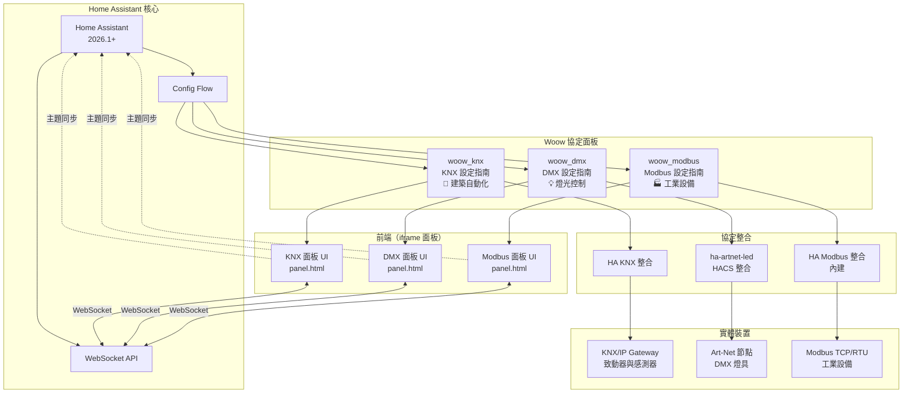
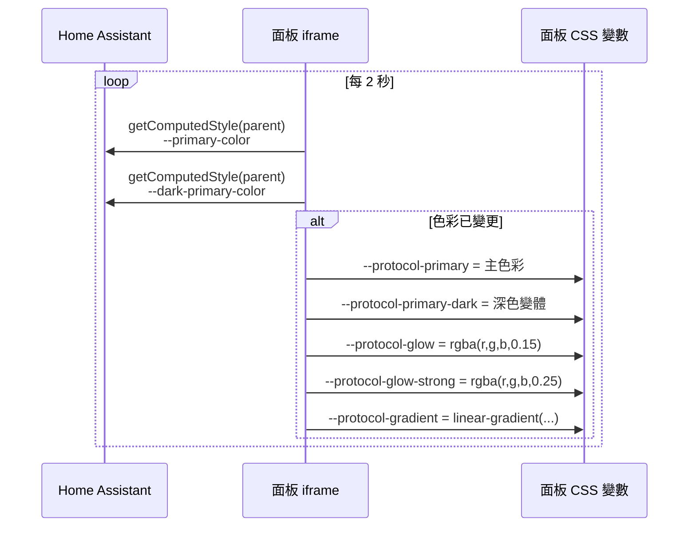
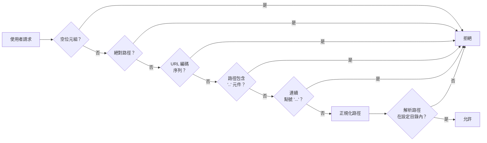

<p align="center">
  
</p>

<h1 align="center">Woow HA 多協定連接器</h1>

<p align="center">
  <strong>企業級 Home Assistant 多協定設定指南</strong><br/>
  KNX、DMX (Art-Net)、Modbus 三大協定的互動式 YAML 設定面板
</p>

<p align="center">
  <a href="#功能特色">功能特色</a> &bull;
  <a href="#系統架構">系統架構</a> &bull;
  <a href="#安裝說明">安裝說明</a> &bull;
  <a href="#面板介紹">面板介紹</a> &bull;
  <a href="#功能截圖">功能截圖</a> &bull;
  <a href="#設定指南">設定指南</a> &bull;
  <a href="#安全機制">安全機制</a> &bull;
  <a href="#測試報告">測試報告</a> &bull;
  <a href="README.md">English</a>
</p>

<p align="center">
  
  
  
  
  
  
</p>

---

## 概述

**Woow HA 多協定連接器** 是一套包含三個 Home Assistant 自定義元件的工具包，為最廣泛使用的建築自動化協定提供互動式、基於瀏覽器的 YAML 設定面板：**KNX**、**DMX (Art-Net/sACN)** 和 **Modbus**。每個面板都提供引導式設定體驗，內建 YAML 編輯器、即時 WebSocket 檔案管理，以及與 Home Assistant 的動態主題同步。

<p align="center">
  
</p>

### 為什麼選擇此套件？

| 問題痛點 | 解決方案 |
|----------|----------|
| 協定 YAML 設定複雜且容易出錯 | 互動式步驟引導面板，搭配語法感知編輯器 |
| 需要在文件和設定檔之間切換 | 內建官方文件連結 + 整合式 YAML 編輯器，一站式完成 |
| 沒有安全的方式從瀏覽器編輯設定 | WebSocket API 搭配原子寫入、路徑穿越保護和當機恢復 |
| 自定義面板的主題不一致 | 動態主題同步 — 面板即時跟隨 HA 主色彩 |
| 需要支援多種建築協定 | 跨 KNX、DMX、Modbus 的統一架構，搭配協定專屬客製化 |
| 行動裝置編輯支援 | 完全響應式 UI — 支援桌面、平板和手機瀏覽器 |

---

## 功能特色

### 核心能力

- **三大協定面板** — KNX（建築自動化）、DMX/Art-Net（燈光控制）、Modbus（工業設備）— 每個都有協定專屬指引
- **互動式 YAML 編輯器** — 瀏覽器內建編輯器，支援語法高亮、Tab 縮排、字體大小調整、鍵盤快捷鍵（Ctrl+S）
- **WebSocket 檔案管理** — 透過 HA 原生 WebSocket 連線進行即時列表/讀取/儲存操作
- **動態主題同步** — 面板每 2 秒自動跟隨 Home Assistant 的 `--primary-color`
- **深色/淺色模式** — 完整支援 HA 兩種主題模式，自動偵測切換
- **當機恢復** — 未儲存的編輯內容快取於 `localStorage`，瀏覽器當機或意外關閉後可恢復
- **國際化支援** — 完整英文和繁體中文翻譯
- **原子寫入** — 設定儲存為原子操作，防止中斷寫入造成損壞
- **HA 重啟整合** — 面板內一鍵重啟 Home Assistant，搭配安全確認

### 協定專屬功能

#### KNX 面板 (`woow_knx`)
- KNX/IP Gateway 通道設定
- 群組地址（Group Address）對應與格式指引
- 實體類型：light、switch、cover、climate、sensor、binary_sensor、scene、fan、number、select
- 完整企業建築範例（3 層辦公大樓，100+ 實體）

#### DMX 面板 (`woow_dmx`)
- Art-Net DMX 節點 IP 與 Universe 設定
- 通道映射（Channel Mapping）燈具對應
- 燈具類型：dimmer、rgb、rgbw、color_temp、rgbww、binary、fixed
- sACN/E1.31 設定支援

#### Modbus 面板 (`woow_modbus`)
- Modbus TCP（網路）和 RTU（串列埠 RS-485/RS-232）
- Slave ID 設定（1–247）
- 暫存器類型：Coil、Discrete Input、Holding Register、Input Register
- 資料型別轉換：int16、uint16、int32、float32 等
- 太陽能逆變器監控範例

### WebSocket API

每個元件透過 Home Assistant 暴露安全的 WebSocket API：

| 動作 | 說明 | 參數 |
|------|------|------|
| `list` | 列出設定目錄中的 YAML 檔案 | `ext`、`depth` |
| `load` | 讀取檔案內容（UTF-8） | `path` |
| `save` | 原子寫入檔案 | `path`、`content` |

---

## 系統架構

### 系統總覽



### 主題同步流程



### WebSocket 安全管線



---

## 安裝說明

### 前置需求

- Home Assistant **2026.1.3** 或更新版本
- HA 管理員存取權限
- KNX：網路上有 KNX/IP Gateway
- DMX：已透過 HACS 安裝 [ha-artnet-led](https://github.com/corneyl/ha-artnet-led)
- Modbus：可存取的 Modbus TCP 或 RTU 裝置

### 步驟 1：複製元件

```bash
# 複製倉庫
git clone https://github.com/WOOWTECH/Woow_ha_multi_protocol_connect.git

# 將所需元件複製到 HA custom_components 目錄
cp -r Woow_ha_multi_protocol_connect/custom_components/woow_knx /config/custom_components/
cp -r Woow_ha_multi_protocol_connect/custom_components/woow_dmx /config/custom_components/
cp -r Woow_ha_multi_protocol_connect/custom_components/woow_modbus /config/custom_components/
```

### 步驟 2：重啟 Home Assistant

```bash
ha core restart
```

### 步驟 3：新增整合

1. 前往 **設定 > 裝置與服務 > 新增整合**
2. 搜尋「Woow KNX Setup Guide」（或 DMX / Modbus）
3. 點擊安裝 — 每個元件使用單例設定流程（每個協定一個實例）
4. 面板將自動出現在 HA 側邊欄

### Docker / Podman 部署

```bash
# 將 custom_components 掛載到容器中
podman run -d \
  --name homeassistant \
  -v /path/to/config:/config \
  -v /path/to/Woow_ha_multi_protocol_connect/custom_components:/config/custom_components \
  -p 8123:8123 \
  ghcr.io/home-assistant/home-assistant:2026.4
```

---

## 面板介紹

### KNX 設定指南

KNX 建築自動化的互動式設定指引 — 涵蓋 KNX/IP Gateway 通道設定、群組地址對應，以及燈光、開關、窗簾、空調、感測器、場景、風扇等實體設定。

<p align="center">
  
</p>

### DMX 設定指南

Art-Net 和 sACN 燈光控制的步驟式設定 — 燈具類型定義、通道映射、Universe 設定和 DMX 節點網路設定。

<p align="center">
  
</p>

### Modbus 設定指南

透過 Modbus TCP 和 RTU 的工業設備整合 — 暫存器映射、資料型別轉換，以及太陽能逆變器、空調和能源監控的實際範例。

<p align="center">
  
</p>

---

## 功能截圖

### 桌面視圖

| KNX 面板（淺色模式） | DMX 面板 | Modbus 面板 |
|:-:|:-:|:-:|
|  |  |  |

### 深色模式

<p align="center">
  
</p>

### 行動裝置視圖

| KNX 行動版 | DMX 行動版 | Modbus 行動版 |
|:-:|:-:|:-:|
|  |  |  |

### YAML 編輯器與檔案瀏覽器

| 編輯器（含 WebSocket 狀態） | 檔案瀏覽器 |
|:-:|:-:|
|  |  |

### Home Assistant 整合

| 側邊欄三面板 | 主題設定 | 整合頁面 |
|:-:|:-:|:-:|
|  |  |  |

---

## 設定指南

### 設定範例

本倉庫包含每個協定的生產就緒 YAML 設定範例：

#### KNX (`config_samples/knx/`)

| 檔案 | 說明 |
|------|------|
| `knx_main.yaml` | 完整 3 層辦公大樓 — 100+ 實體（燈光、空調、感測器、窗簾、場景） |
| `knx_automations.yaml` | KNX 事件觸發的自動化工作流程 |
| `knx_scripts.yaml` | 場景召回和批次控制的腳本定義 |

#### DMX (`config_samples/dmx/`)

| 檔案 | 說明 |
|------|------|
| `dmx_artnet.yaml` | Art-Net 節點設定模板 |
| `dmx_sacn.yaml` | sACN/E1.31 設定模板 |
| `dmx_fixtures.yaml` | 所有支援類型的燈具定義 |
| `dmx_scenes.yaml` | DMX 場景定義和記憶召回 |

#### Modbus (`config_samples/modbus/`)

| 檔案 | 說明 |
|------|------|
| `modbus_tcp.yaml` | TCP 連線設定 |
| `modbus_rtu.yaml` | RTU 串列埠設定 |
| `modbus_solar.yaml` | 太陽能逆變器監控範例 |
| `modbus_automations.yaml` | Modbus 觸發的自動化規則 |

---

## 安全機制

### 路徑穿越保護

三個元件都實作了加固的 7 層路徑消毒管線：

```
1. 拒絕空位元組 (\x00)
2. 拒絕絕對路徑（/ 或 \）
3. 拒絕 URL 編碼序列（%2e、%2f 等）
4. 將反斜線正規化為正斜線
5. 拒絕 '..' 作為任何路徑元件
6. 拒絕連續點號（...）
7. 驗證解析路徑在設定目錄內（真實路徑檢查）
```

### 安全特性

| 功能 | 說明 |
|------|------|
| **路徑消毒** | 7 層管線防止目錄穿越攻擊 |
| **僅管理員存取** | 面板需要 HA 管理員身份驗證 |
| **原子寫入** | 檔案儲存為原子操作 — 當機時不會產生部分寫入 |
| **WebSocket 認證** | 所有 API 呼叫透過 HA 原生 WebSocket 令牌認證 |
| **目錄隔離** | 每個元件只在自己的設定目錄內讀寫 |
| **符號連結保護** | 解析真實路徑防止符號連結逃逸攻擊 |
| **輸入驗證** | 所有使用者提供的路徑在檔案系統存取前驗證 |

---

## 測試報告

### 測試覆蓋總覽

本專案經過全面的企業級測試：

| 測試套件 | 測試數 | 通過率 | 覆蓋範圍 |
|----------|--------|--------|----------|
| **企業整合測試** | 175 | 100% | 部署、WebSocket API、安全、邊緣案例、前端、隔離、重啟、日誌、回歸 |
| **主題同步測試（Playwright）** | 16 | 100% | 色彩同步、深色模式、跨面板一致性、導航穩定性 |
| **總計** | **191** | **100%** | 全棧覆蓋 |

### 企業整合測試（175 個測試）

| 階段 | 測試數 | 說明 |
|------|--------|------|
| 1. 部署生命週期 | 11 | 元件安裝、設定項目、面板註冊 |
| 2. WebSocket 後端 API | 36 | 列表/讀取/儲存操作、錯誤處理 |
| 3. 安全邊界 | 34 | 路徑穿越、權限執行、注入防禦 |
| 4. 邊緣案例與壓力 | 8 | 大檔案、並發存取、格式錯誤輸入 |
| 5. 前端面板 | 57 | UI 渲染、主題同步、編輯器功能 |
| 6. 跨元件隔離 | 11 | 三協定獨立性驗證 |
| 7. HA 重啟韌性 | 11 | 元件在 HA 重啟後存活 |
| 8. 日誌與錯誤處理 | 4 | 正確的日誌記錄和錯誤報告 |
| 9. 多輪回歸 | 3 | 重複測試循環的穩定性 |

### Playwright 主題同步測試（16 個測試）

| 組別 | 測試數 | 說明 |
|------|--------|------|
| 1. 基本同步 | 4 | 初始渲染、色彩變更跟隨、全部 5 個 CSS 變數、連續變更 |
| 2. 色彩解析 | 4 | 黑/白/紅邊緣值、dark-primary-color 回退 |
| 3. 深色模式 | 2 | 深色模式同步、深→淺切換無殘留色彩 |
| 4. 穩定性 | 3 | 3 秒 SLA、快速 5 次變更、導航離開/返回 |
| 5. 跨面板 | 3 | 三面板色彩一致、視覺 hero 背景匹配 |

### 執行測試

```bash
# 企業整合測試
python test_enterprise.py

# Playwright 主題同步測試
cd tests/theme-sync
npm install
node_modules/.bin/playwright test --config=playwright.config.ts
```

---

## 專案結構

```
Woow_ha_multi_protocol_connect/
├── custom_components/              # HA 自定義元件包
│   ├── woow_knx/                  # KNX 設定指南
│   │   ├── __init__.py            # 元件 + WebSocket 處理器
│   │   ├── config_flow.py         # 單例設定流程
│   │   ├── const.py               # 常數
│   │   ├── manifest.json          # v2.1.0
│   │   ├── strings.json           # 預設字串
│   │   ├── frontend/
│   │   │   └── panel.html         # 互動式 UI（1600+ 行）
│   │   └── translations/
│   │       ├── en.json            # 英文
│   │       └── zh-Hant.json       # 繁體中文
│   ├── woow_dmx/                  # DMX 設定指南（相同結構）
│   └── woow_modbus/               # Modbus 設定指南（相同結構）
│
├── config_samples/                 # 生產就緒 YAML 範例
│   ├── knx/                       # KNX 設定（3 層辦公大樓）
│   ├── dmx/                       # DMX/Art-Net/sACN 設定
│   └── modbus/                    # Modbus TCP/RTU 設定
│
├── simulators/                     # 協定模擬器（測試用）
│   ├── knx_simulator.py           # KNX/IP 通道模擬器
│   ├── dmx_artnet_simulator.py    # Art-Net DMX 模擬器
│   └── modbus_simulator.py        # Modbus TCP/RTU 模擬器
│
├── tests/                          # 測試套件
│   └── theme-sync/                # Playwright 瀏覽器自動化測試
│
├── test_enterprise.py              # 企業整合測試（175 個案例）
├── test_integration_deploy.py      # 部署驗證測試
├── test_directory_isolation.py     # 安全邊界測試
├── PRD.md                          # 產品需求文件
├── README.md                       # 英文文件
└── README_zh-TW.md                 # 繁體中文文件（本檔案）
```

---

## 版本紀錄

### v2.1.0 (2026-04)

- **功能：** 動態主題同步 — 面板透過 2 秒輪詢即時跟隨 HA 的 `--primary-color`
- **功能：** 完整深色/淺色模式支援，自動偵測切換
- **安全：** 加固 7 層路徑消毒管線，取代易受攻擊的單次替換
- **測試：** Playwright 瀏覽器自動化測試套件 — 5 組 16 個測試（色彩同步、深色模式、跨面板、穩定性）
- **測試：** 企業整合測試 — 9 階段 175 個測試（100% 通過率）
- **UI：** 行動裝置和平板的響應式設計改進
- **UI：** 透過 localStorage 的當機恢復功能
- **國際化：** 完整英文和繁體中文翻譯

### v2.0.0 (2026-03)

- **功能：** 三個統一協定面板（KNX、DMX、Modbus）
- **功能：** 基於 WebSocket 的 YAML 編輯器（列表/讀取/儲存）
- **功能：** 單例設定流程（每個協定一個面板）
- **功能：** 面板內 HA 重啟整合
- **安全：** 路徑穿越保護和僅管理員存取
- **範例：** 所有協定的生產就緒設定範例

---

## 支援

- **官網：** [https://aiot.woowtech.io](https://aiot.woowtech.io)
- **部落格：** [https://aiot.woowtech.io/blog](https://aiot.woowtech.io/blog)
- **問題回報：** [GitHub Issues](https://github.com/WOOWTECH/Woow_ha_multi_protocol_connect/issues)

---

## 授權條款

本專案採用 **MIT 授權條款**。

---

<p align="center">
  <sub>由 <a href="https://github.com/WOOWTECH">WOOWTECH</a> 用心打造 &bull; 基於 Home Assistant</sub>
</p>
