<p align="center">
  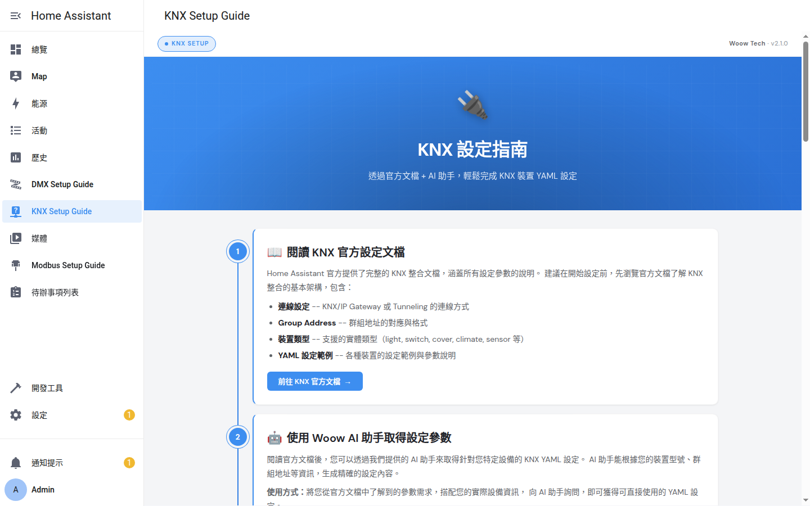
</p>

<h1 align="center">Woow HA 多協定連接器</h1>

<p align="center">
  <strong>企業級 Home Assistant 多協定設定指南</strong><br/>
  KNX、DMX (Art-Net)、Modbus 三大協定的互動式 YAML 設定面板
</p>

<p align="center">
  <a href="#功能特色">功能特色</a> &bull;
  <a href="#系統架構">系統架構</a> &bull;
  <a href="#安裝說明">安裝說明</a> &bull;
  <a href="#面板介紹">面板介紹</a> &bull;
  <a href="#功能截圖">功能截圖</a> &bull;
  <a href="#設定指南">設定指南</a> &bull;
  <a href="#安全機制">安全機制</a> &bull;
  <a href="#測試報告">測試報告</a> &bull;
  <a href="README.md">English</a>
</p>

<p align="center">
  
  
  
  
  
  
</p>

---

## 概述

**Woow 多協定連接器** 是單一個 Home Assistant 自定義整合（domain 為 `woow_multi_protocol`），為最廣泛使用的建築自動化協定提供互動式、基於瀏覽器的 YAML 設定面板：**KNX**、**DMX (Art-Net/sACN)** 和 **Modbus**。單一側邊欄面板以分頁形式呈現已啟用的協定，每個分頁都提供引導式設定體驗，內建 YAML 編輯器、即時 WebSocket 檔案管理，以及與 Home Assistant 的動態主題同步。顯示哪些協定由整合的 **選項（Options）** 流程控制。

<p align="center">
  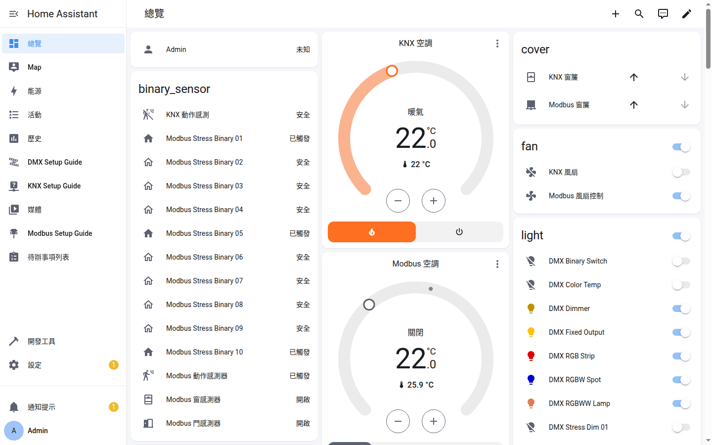
</p>

### 為什麼選擇此套件？

| 問題痛點 | 解決方案 |
|----------|----------|
| 協定 YAML 設定複雜且容易出錯 | 互動式步驟引導面板，搭配語法感知編輯器 |
| 需要在文件和設定檔之間切換 | 內建官方文件連結 + 整合式 YAML 編輯器，一站式完成 |
| 沒有安全的方式從瀏覽器編輯設定 | WebSocket API 搭配原子寫入、路徑穿越保護和當機恢復 |
| 自定義面板的主題不一致 | 動態主題同步 — 面板即時跟隨 HA 主色彩 |
| 需要支援多種建築協定 | 跨 KNX、DMX、Modbus 的統一架構，搭配協定專屬客製化 |
| 行動裝置編輯支援 | 完全響應式 UI — 支援桌面、平板和手機瀏覽器 |

---

## 功能特色

### 核心能力

- **三大協定面板** — KNX（建築自動化）、DMX/Art-Net（燈光控制）、Modbus（工業設備）— 每個都有協定專屬指引
- **互動式 YAML 編輯器** — 瀏覽器內建編輯器，支援語法高亮、Tab 縮排、字體大小調整、鍵盤快捷鍵（Ctrl+S）
- **WebSocket 檔案管理** — 透過 HA 原生 WebSocket 連線進行即時列表/讀取/儲存操作
- **Service 服務層** — 單一服務組（`list_files`、`load_file`、`save_file`、`apply`），每項都需帶入 `protocol` 欄位，以 Home Assistant 服務形式提供（僅限管理員、各協定沙箱化）— 可從自動化、腳本與開發者工具呼叫
- **原生主題繼承** — 面板為 LitElement `panel_custom` Web Components，直接繼承 HA 的主題 CSS 變數（`--primary-color` 等）— 色彩與深/淺色模式即時跟隨 HA，無需 iframe 或輪詢
- **深色/淺色模式** — 完整支援 HA 兩種主題模式，自動偵測切換
- **當機恢復** — 未儲存的編輯內容快取於 `localStorage`，瀏覽器當機或意外關閉後可恢復
- **國際化支援** — 完整英文和繁體中文翻譯
- **原子寫入** — 設定儲存為原子操作，防止中斷寫入造成損壞
- **HA 重啟整合** — 面板內一鍵重啟 Home Assistant，搭配安全確認

### 協定專屬功能

#### KNX 面板 (`woow_knx`)
- KNX/IP Gateway 通道設定
- 群組地址（Group Address）對應與格式指引
- 實體類型：light、switch、cover、climate、sensor、binary_sensor、scene、fan、number、select
- 完整企業建築範例（3 層辦公大樓，100+ 實體）

#### DMX 面板 (`woow_dmx`)
- Art-Net DMX 節點 IP 與 Universe 設定
- 通道映射（Channel Mapping）燈具對應
- 燈具類型：dimmer、rgb、rgbw、color_temp、rgbww、binary、fixed
- sACN/E1.31 設定支援

#### Modbus 面板 (`woow_modbus`)
- Modbus TCP（網路）和 RTU（串列埠 RS-485/RS-232）
- Slave ID 設定（1–247）
- 暫存器類型：Coil、Discrete Input、Holding Register、Input Register
- 資料型別轉換：int16、uint16、int32、float32 等
- 太陽能逆變器監控範例

### WebSocket API

本整合透過 Home Assistant 暴露安全的 WebSocket API：

| 動作 | 說明 | 參數 |
|------|------|------|
| `list` | 列出設定目錄中的 YAML 檔案 | `ext`、`depth` |
| `load` | 讀取檔案內容（UTF-8） | `path` |
| `save` | 原子寫入檔案 | `path`、`content` |

### Service API（服務）

相同的檔案操作也以 Home Assistant 服務形式提供，統一置於單一的 `woow_multi_protocol`
domain 下。每次呼叫都需帶入 `protocol: knx | dmx | modbus` 欄位，並沙箱化於
`<config>/woow_multi_protocol/<protocol>/` 且僅限管理員（詳見 [ADR-0002](docs/adr/0002-apply-reload-semantics.md)）：

| 服務 | 說明 | 欄位 |
|------|------|------|
| `woow_multi_protocol.list_files` | 列出協定子目錄中的設定檔 | `protocol`、`ext`、`depth` |
| `woow_multi_protocol.load_file` | 讀取 UTF-8 檔案（回傳 `content`、`path`） | `protocol`、`path` |
| `woow_multi_protocol.save_file` | 原子寫入檔案（僅寫入） | `protocol`、`path`、`content` |
| `woow_multi_protocol.apply` | 重載底層整合使已儲存設定生效；除非設定 `force_restart`，否則僅回報 `restart_required` 而不重啟 | `protocol`、`force_restart` |

---

## 系統架構

### 系統總覽

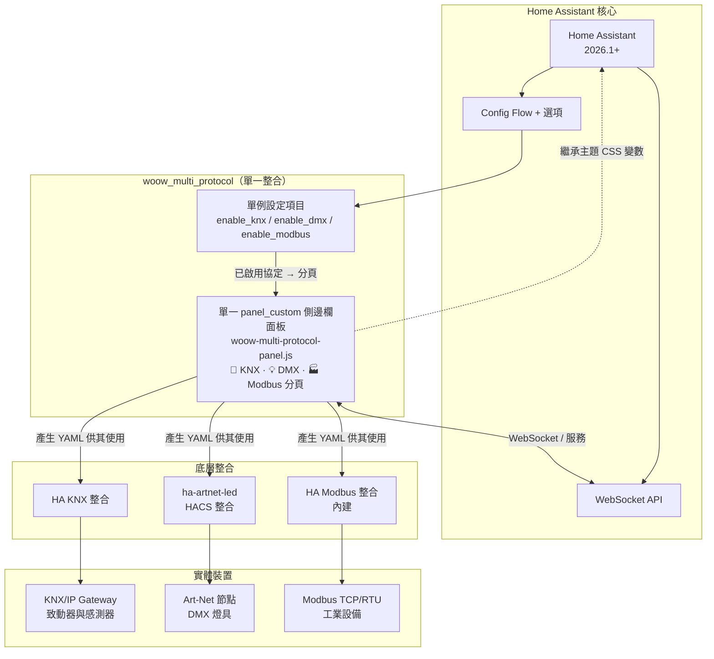

### 主題繼承

由於面板是渲染於 HA 前端內的 `panel_custom` Web Components（而非沙箱化的 iframe），它們可透過 DOM 直接繼承 Home Assistant 的主題 CSS 自訂屬性。面板樣式引用 HA 變數（如 `--primary-color`、`--primary-background-color`、`--primary-text-color`）並帶有合理的回退值 — 因此色彩變更與深/淺色模式切換會即時套用，無需輪詢或手動解析色彩。

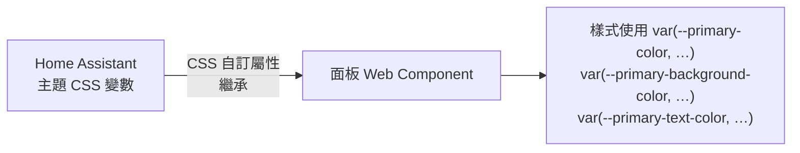

> 面板 Web Component 由倉庫根目錄的 `panel_frontend/` 工作區（Lit + Rollup）建置，並部署至整合的 `frontend/` 目錄。此工作區位於 `custom_components/` 之外，因此 HACS 只會封裝 `woow_multi_protocol` 資料夾。

### WebSocket 安全管線

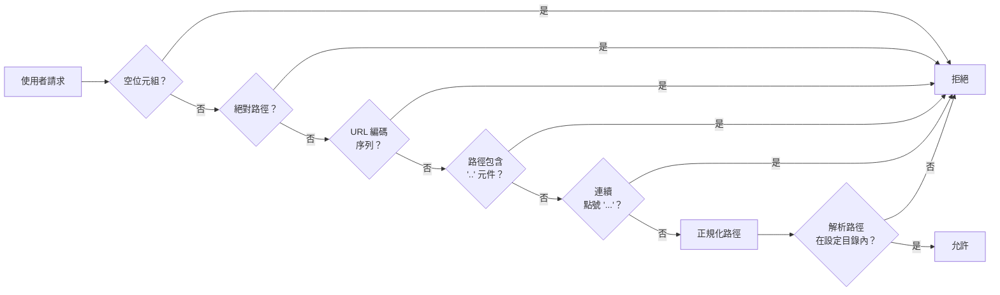

---

## 安裝說明

Woow 多協定連接器是**單一**個 Home Assistant 整合（`woow_multi_protocol`），
以 **HACS 自訂倉庫（custom repository）** 方式安裝。

### 前置需求

- Home Assistant **2026.1.0** 或更新版本
- 已安裝並設定好 [HACS](https://hacs.xyz)
- HA 管理員存取權限
- KNX：網路上有 KNX/IP Gateway
- DMX：已透過 HACS 安裝 [ha-artnet-led](https://github.com/corneyl/ha-artnet-led)
- Modbus：可存取的 Modbus TCP 或 RTU 裝置

### 步驟 1：將自訂倉庫加入 HACS

1. 在 Home Assistant 中開啟 **HACS**。
2. 點擊右上角 **⋮** 選單 → **自訂倉庫（Custom repositories）**。
3. 填入倉庫 URL 並選擇 **Integration（整合）** 類別：
   - **倉庫：** `https://github.com/WOOWTECH/Woow_ha_multi_protocol_connect`
   - **類別：** `Integration`
4. 點擊 **新增（Add）**，「Woow Multi-Protocol Connect」即會出現在 HACS 中。

### 步驟 2：下載並重啟

1. 在 HACS 中開啟 **Woow Multi-Protocol Connect**，點擊 **下載（Download）**。
2. 依提示 **重啟 Home Assistant**，使整合被載入。

### 步驟 3：新增整合

1. 前往 **設定 → 裝置與服務 → 新增整合**。
2. 搜尋 **Woow Multi-Protocol Connect** 並選擇它。
3. 點擊 **提交（Submit）** — 會建立單一、單例的設定項目（只會新增一個實例）。
4. **Woow Multi-Protocol Connect** 面板會出現在 HA 側邊欄，並依已啟用的協定顯示分頁。

### 步驟 4：選擇要顯示的協定（選項）

面板**預設顯示全部三個協定**。若要隱藏用不到的協定：

1. 前往 **設定 → 裝置與服務 → Woow Multi-Protocol Connect → 設定（Configure）**。
2. 依需要切換 **Enable KNX**、**Enable DMX**、**Enable Modbus**。
3. 儲存 — 設定項目會重載，面板分頁隨之重建。建議至少保留一個協定啟用，面板才有作用。

這些切換同時也影響服務層：被停用的 `protocol` 無法從面板選取，但
`<config>/woow_multi_protocol/<protocol>/` 下的沙箱目錄不會被更動。

### 手動安裝（不使用 HACS）

不想用 HACS？將單一整合資料夾複製到你的設定目錄：

```bash
git clone https://github.com/WOOWTECH/Woow_ha_multi_protocol_connect.git
cp -r Woow_ha_multi_protocol_connect/custom_components/woow_multi_protocol /config/custom_components/
# 接著重啟 Home Assistant，並依步驟 3 新增整合
```

### 從舊的 `woow_knx` / `woow_dmx` / `woow_modbus` 整合升級

> **乾淨分手 — 無自動遷移。** 3.0.0 版將先前三個整合（`woow_knx`、`woow_dmx`、
> `woow_modbus`）合併為這個單一的 `woow_multi_protocol` 整合。Home Assistant 無法
> 跨 domain 遷移設定項目，因此舊的設定項目、服務（`woow_knx.*` 等）與沙箱路徑
> **不會**沿用。這是刻意的行為，並以主版號升級為界。

升級步驟：

1. **備份**你曾透過舊面板編輯的 YAML — 它們位於 `<config>/woow_knx/`、
   `<config>/woow_dmx/` 與 `<config>/woow_modbus/`。
2. **移除**舊整合：在 **設定 → 裝置與服務** 中刪除其設定項目，然後移除
   `custom_components/woow_knx`、`custom_components/woow_dmx` 與
   `custom_components/woow_modbus` 資料夾（若你另外透過 HACS 安裝，則從 HACS 解除安裝）。
3. **重啟** Home Assistant。
4. 依上述步驟 1–3 **安裝** Woow 多協定連接器。
5. 將你的 YAML **搬移**至新的各協定沙箱 `<config>/woow_multi_protocol/knx/`、
   `.../dmx/` 與 `.../modbus/`，再以面板或 `woow_multi_protocol.*` 服務載入並套用。

### Docker / Podman 部署

若採手動（非 HACS）安裝，將單一整合資料夾掛載進容器的 `custom_components`：

```bash
podman run -d \
  --name homeassistant \
  -v /path/to/config:/config \
  -v /path/to/Woow_ha_multi_protocol_connect/custom_components/woow_multi_protocol:/config/custom_components/woow_multi_protocol \
  -p 8123:8123 \
  ghcr.io/home-assistant/home-assistant:2026.4
```

---

## 面板介紹

### KNX 設定指南

KNX 建築自動化的互動式設定指引 — 涵蓋 KNX/IP Gateway 通道設定、群組地址對應，以及燈光、開關、窗簾、空調、感測器、場景、風扇等實體設定。

<p align="center">
  
</p>

### DMX 設定指南

Art-Net 和 sACN 燈光控制的步驟式設定 — 燈具類型定義、通道映射、Universe 設定和 DMX 節點網路設定。

<p align="center">
  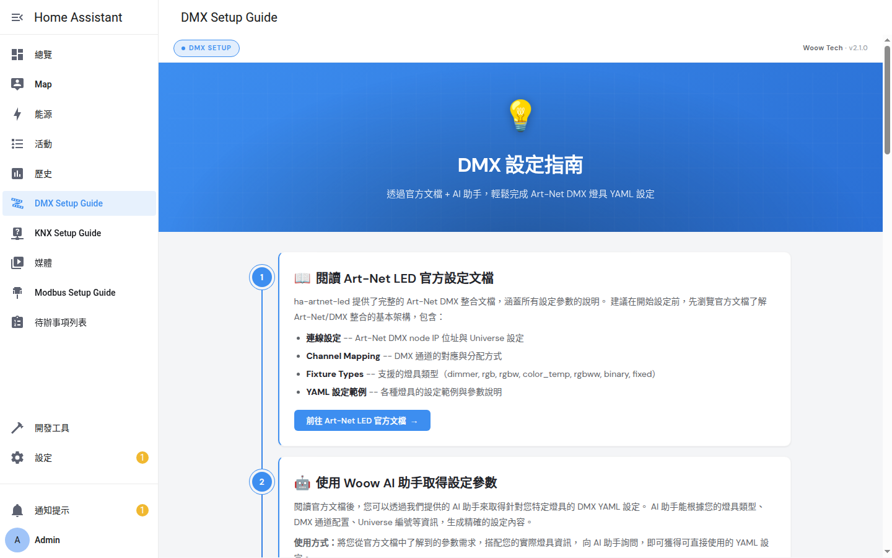
</p>

### Modbus 設定指南

透過 Modbus TCP 和 RTU 的工業設備整合 — 暫存器映射、資料型別轉換，以及太陽能逆變器、空調和能源監控的實際範例。

<p align="center">
  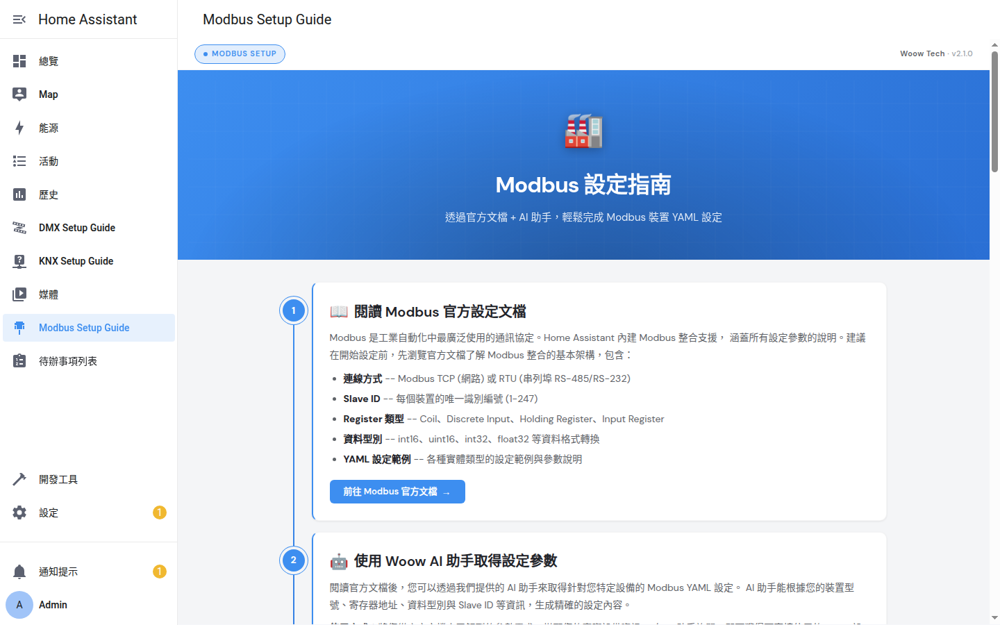
</p>

---

## 功能截圖

### 桌面視圖

| KNX 面板（淺色模式） | DMX 面板 | Modbus 面板 |
|:-:|:-:|:-:|
|  |  |  |

### 深色模式

<p align="center">
  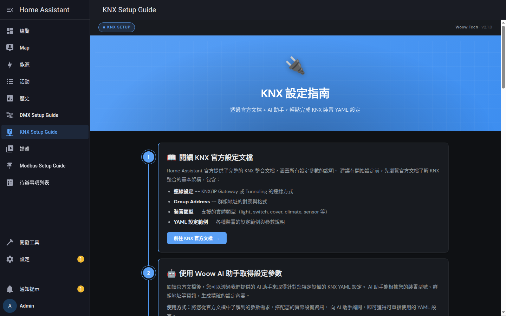
</p>

### 行動裝置視圖

| KNX 行動版 | DMX 行動版 | Modbus 行動版 |
|:-:|:-:|:-:|
| 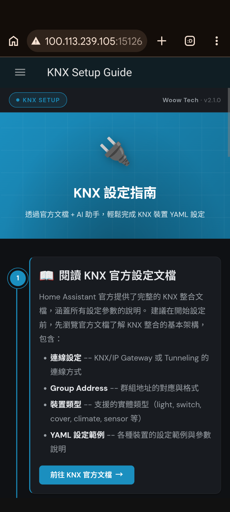 | 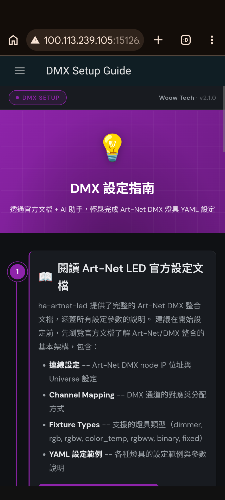 | 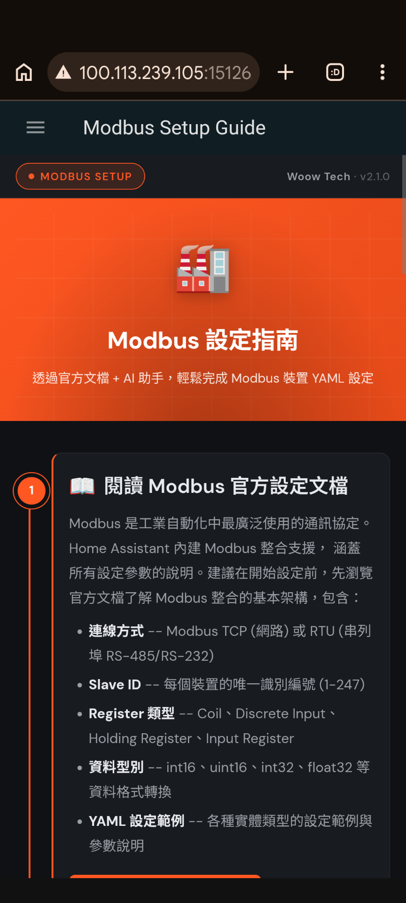 |

### YAML 編輯器與檔案瀏覽器

| 編輯器（含 WebSocket 狀態） | 檔案瀏覽器 |
|:-:|:-:|
| 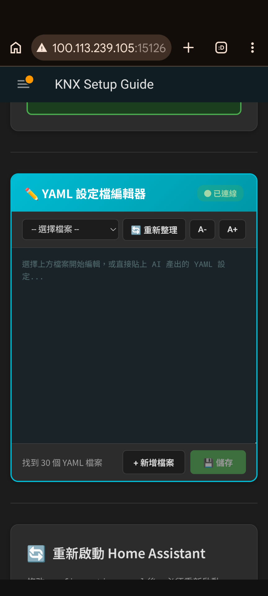 | 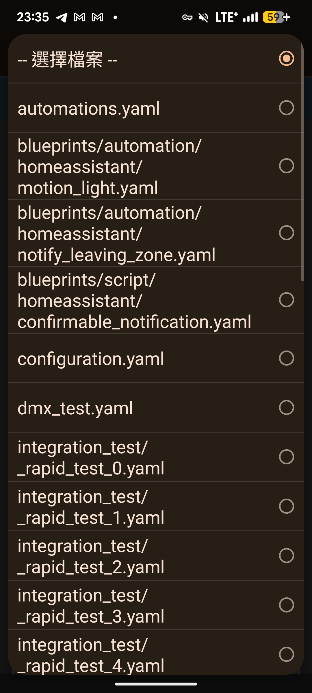 |

### Home Assistant 整合

| 側邊欄三面板 | 主題設定 | 整合頁面 |
|:-:|:-:|:-:|
|  | 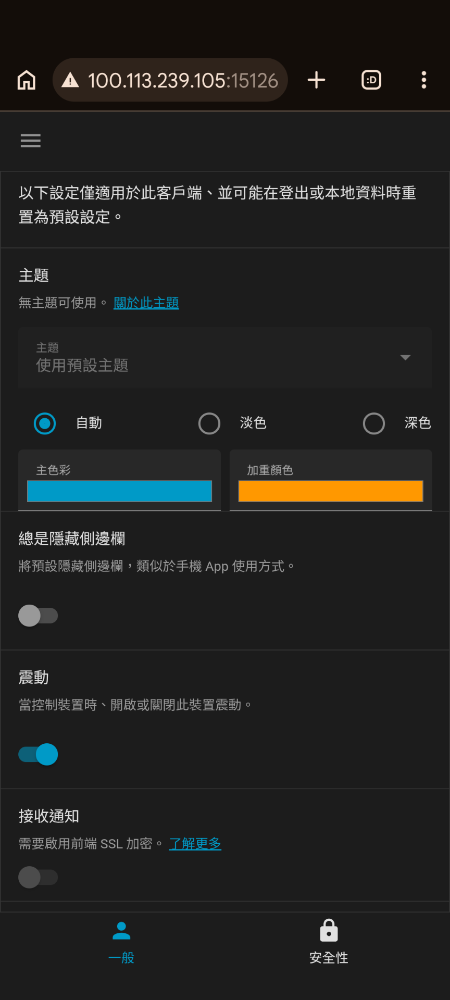 | 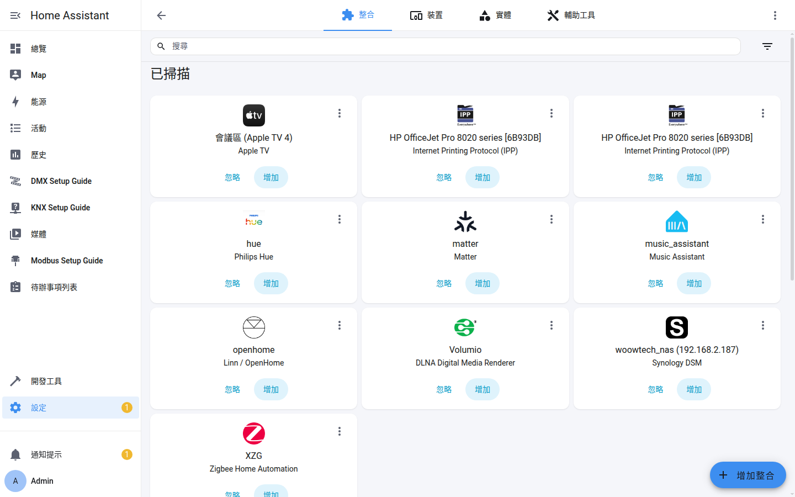 |

---

## 設定指南

### 設定範例

本倉庫包含每個協定的生產就緒 YAML 設定範例：

#### KNX (`config_samples/knx/`)

| 檔案 | 說明 |
|------|------|
| `knx_main.yaml` | 完整 3 層辦公大樓 — 100+ 實體（燈光、空調、感測器、窗簾、場景） |
| `knx_automations.yaml` | KNX 事件觸發的自動化工作流程 |
| `knx_scripts.yaml` | 場景召回和批次控制的腳本定義 |

#### DMX (`config_samples/dmx/`)

| 檔案 | 說明 |
|------|------|
| `dmx_artnet.yaml` | Art-Net 節點設定模板 |
| `dmx_sacn.yaml` | sACN/E1.31 設定模板 |
| `dmx_fixtures.yaml` | 所有支援類型的燈具定義 |
| `dmx_scenes.yaml` | DMX 場景定義和記憶召回 |

#### Modbus (`config_samples/modbus/`)

| 檔案 | 說明 |
|------|------|
| `modbus_tcp.yaml` | TCP 連線設定 |
| `modbus_rtu.yaml` | RTU 串列埠設定 |
| `modbus_solar.yaml` | 太陽能逆變器監控範例 |
| `modbus_automations.yaml` | Modbus 觸發的自動化規則 |

---

## 安全機制

### 路徑穿越保護

所有檔案操作都會經過加固的 7 層路徑消毒管線：

```
1. 拒絕空位元組 (\x00)
2. 拒絕絕對路徑（/ 或 \）
3. 拒絕 URL 編碼序列（%2e、%2f 等）
4. 將反斜線正規化為正斜線
5. 拒絕 '..' 作為任何路徑元件
6. 拒絕連續點號（...）
7. 驗證解析路徑在設定目錄內（真實路徑檢查）
```

### 安全特性

| 功能 | 說明 |
|------|------|
| **路徑消毒** | 7 層管線防止目錄穿越攻擊 |
| **後端僅限管理員** | 檔案編輯的 WebSocket 命令與服務皆需 HA 管理員；所有檔案系統存取僅限管理員 |
| **原子寫入** | 檔案儲存為原子操作 — 當機時不會產生部分寫入 |
| **WebSocket 認證** | 所有 API 呼叫透過 HA 原生 WebSocket 令牌認證 |
| **目錄隔離** | 每個協定只在自己的 `<config>/woow_multi_protocol/<protocol>/` 沙箱內讀寫 |
| **符號連結保護** | 解析真實路徑防止符號連結逃逸攻擊 |
| **輸入驗證** | 所有使用者提供的路徑在檔案系統存取前驗證 |

---

## 測試報告

### 測試覆蓋總覽

本專案經過全面的企業級測試。測試分為兩類：於 CI 自動執行的 **hermetic**（無外部相依）套件，以及需要執行中 Home Assistant 或瀏覽器的 **live/選用** 套件。

| 測試套件 | 測試數 | 執行環境 | 通過率 | 覆蓋範圍 |
|----------|--------|----------|--------|----------|
| **服務層（hermetic）** | 14 | CI（`pytest`） | 100% | 管理員權限、沙箱邊界、檔案操作、apply/reload 語意 |
| **設定與面板接縫（hermetic）** | 14 | CI（`pytest`） | 100% | 單例設定流程、各協定啟用切換、面板註冊 |
| **hermetic 合計（CI）** | **28** | CI（`pytest`） | **100%** | `tests/services` + `tests/config` |
| **企業整合測試** | 10 階段 | 實機 HA（選用） | 100% | 部署、WebSocket API、安全、邊緣案例、前端、選項→分頁、跨協定隔離、重啟、日誌/回歸、服務層 |
| **主題同步測試（Playwright）** | 12 | 瀏覽器（選用） | 100% | 面板結構（分頁）、色彩/主題同步、深色模式與背景 |

> CI（`.github/workflows/ci.yml`）於每次 push 與 PR 執行 ruff lint、hassfest manifest 驗證、**28 個 hermetic 測試**（`tests/services` + `tests/config`，由 `pytest.ini` 界定範圍），以及前端建置。live 企業測試與 Playwright 套件為選用，**不**在 CI 執行。企業套件最後一次凍結的完整執行為 **175/175**（v2.0.0，9 階段 — 見 [`docs/testing/2026-04-10-test-report.md`](docs/testing/2026-04-10-test-report.md)）；合併後的整合再加上第 10 個服務層階段。

### 企業整合套件（`tests/live/live_enterprise.py`）

對實機 Home Assistant 執行的十個階段。下方各階段測試數為最後一次凍結的完整執行
（v2.0.0，**175/175** — 見[日期化報告](docs/testing/2026-04-10-test-report.md)）；
第 10 階段隨服務層在 v3.0.0 加入。

| 階段 | 測試數 | 說明 |
|------|--------|------|
| 1. 部署生命週期 | 11 | 元件安裝、單例設定項目、面板註冊 |
| 2. WebSocket 後端 API | 36 | 列表/讀取/儲存操作、錯誤處理 |
| 3. 安全邊界 | 34 | 路徑穿越、權限執行、注入防禦 |
| 4. 邊緣案例與壓力 | 8 | 大檔案、並發存取、格式錯誤輸入 |
| 5. 前端面板 | 57 | 單一分頁打包 — 渲染、主題同步、編輯器功能 |
| 6. 選項→分頁 + 跨協定隔離 | 11 | 已啟用協定驅動分頁；每個協定只看到自己的沙箱 |
| 7. HA 重啟韌性 | 11 | 面板與 API 在 HA 重啟後存活 |
| 8. 日誌與錯誤處理 | 4 | 正確的日誌記錄和錯誤報告 |
| 9. 多輪回歸與 soak | 3 | 重複測試循環的穩定性 |
| 10. 服務層 *（v3.0.0 新增）* | — | 透過 REST 的 `list_files` / `load_file` / `save_file` / `apply` — 管理員權限、沙箱、apply 契約 |

### Playwright 面板與主題同步套件（`tests/theme-sync/`，12 個測試）

| 組別 | 測試數 | 說明 |
|------|--------|------|
| 1. 面板結構 | 4 | 分頁等於已啟用協定、載入時第一個分頁啟用、點擊可啟用分頁、同時僅一個分頁啟用 |
| 2. 主題同步 | 5 | 初始渲染的主色彩、跟隨 HA 色彩變更、`--primary-color` 抵達面板、連續變更收斂、色彩在分頁切換後保留 |
| 3. 背景 / 深色模式就緒 | 3 | 面板背景符合 `--primary-background-color`、跟隨背景變數變更、背景為深色時仍跟隨主色彩 |

### 執行測試

```bash
# Hermetic 測試（無外部相依；此為 CI 執行的內容）
pip install -r requirements-test.txt
pytest                       # testpaths = tests/services tests/config（見 pytest.ini）

# 企業整合測試（獨立腳本；需要執行中的 HA）
python tests/live/live_enterprise.py

# Playwright 主題同步測試
cd tests/theme-sync
npm install
node_modules/.bin/playwright test --config=playwright.config.ts
```

---

## 專案結構

```
Woow_ha_multi_protocol_connect/
├── custom_components/              # HA 自定義元件包（僅一個）
│   └── woow_multi_protocol/        # 合併後的單一整合
│       ├── __init__.py            # 設定 + WebSocket 處理器 + 路徑安全
│       ├── config_flow.py         # 單例設定流程 + 各協定選項
│       ├── const.py               # domain、協定清單、啟用切換輔助
│       ├── services.py            # 服務層（list/load/save/apply，以 protocol 參數化）
│       ├── services.yaml          # 服務定義（開發者工具 UI）
│       ├── manifest.json          # v3.0.0
│       ├── strings.json           # 設定 + 選項字串
│       ├── brand/                 # WOOWTECH 圖示/Logo 資產（單一組）
│       ├── frontend/
│       │   ├── woow-multi-protocol-panel.js  # LitElement 分頁面板打包
│       │   └── sidebar-title.js   # 側邊欄標題渲染
│       └── translations/
│           ├── en.json            # 英文
│           └── zh-Hant.json       # 繁體中文
│
├── panel_frontend/                 # 面板建置工作區（Lit + Rollup），位於倉庫根目錄
│   ├── package.json               # 建置工具與 lit 相依
│   ├── rollup.config.js           # 打包器設定
│   ├── scripts/deploy.js          # 將建置產物複製進整合
│   └── src/                        # 分頁外殼、各協定設定、樣式、i18n
│
├── config_samples/                 # 生產就緒 YAML 範例
│   ├── knx/                       # KNX 設定（3 層辦公大樓）
│   ├── dmx/                       # DMX/Art-Net/sACN 設定
│   └── modbus/                    # Modbus TCP/RTU 設定
│
├── simulators/                     # 協定模擬器（測試用）
│   ├── knx_simulator.py           # KNX/IP 通道模擬器
│   ├── dmx_artnet_simulator.py    # Art-Net DMX 模擬器
│   ├── modbus_simulator.py        # Modbus TCP/RTU 模擬器
│   └── requirements.txt           # 模擬器相依套件
│
├── tests/                          # 測試套件
│   ├── services/                  # 服務層 hermetic 單元測試（CI 執行）
│   │   ├── conftest.py
│   │   ├── test_admin_gating.py         # 管理員權限強制
│   │   ├── test_apply_semantics.py      # apply / reload / restart 行為
│   │   ├── test_file_operations.py      # list/load/save 操作
│   │   └── test_sandbox_boundary.py     # 各協定沙箱隔離
│   ├── config/                    # 設定/初始化接縫 hermetic 測試（CI 執行）
│   │   ├── conftest.py
│   │   ├── test_config_flow.py          # 單例設定流程
│   │   ├── test_options_flow.py         # 各協定啟用切換
│   │   └── test_panel_registration.py   # 面板註冊
│   ├── theme-sync/                # Playwright 瀏覽器自動化測試
│   │   ├── playwright.config.ts   # 測試設定
│   │   ├── helpers.ts             # 共用測試工具
│   │   └── theme-sync.spec.ts     # 3 組 12 個測試案例
│   ├── live/                      # 獨立即時整合腳本（選用）
│   │   ├── live_enterprise.py            # 企業整合測試
│   │   ├── live_integration_deploy.py    # 部署驗證測試
│   │   ├── live_directory_isolation.py   # 安全邊界測試
│   │   └── live_simulators.py            # 模擬器即時協定測試
│   └── e2e-panels.sh              # 端對端面板測試執行器
│
├── .github/workflows/             # CI（ci.yml）＋發布（release.yml）
├── docs/
│   ├── adr/                       # 架構決策紀錄（ADR）
│   ├── agents/                    # Agent 指南（issue 追蹤、triage、domain）
│   ├── plans/                     # 設計/實作計畫
│   ├── testing/                   # 測試計畫＋日期化測試報告
│   └── screenshots/              # 文件截圖
├── hacs.json                       # HACS 中繼資料
├── pytest.ini                      # 測試設定（testpaths = tests/services tests/config）
├── ruff.toml                       # Lint 設定
├── requirements-test.txt           # 測試相依套件
├── CLAUDE.md / CONTEXT.md          # 給 agent 的專案與領域說明
├── README.md                       # 英文文件
└── README_zh-TW.md                 # 繁體中文文件（本檔案）
```

---

## 版本紀錄

### v3.0.0 (2026-08) — 單一 HACS 整合

> **重大變更。** 三個獨立整合（`woow_knx`、`woow_dmx`、`woow_modbus`）合併為單一
> 整合 `woow_multi_protocol`。無自動遷移 — 請見[升級說明](#從舊的-woow_knx--woow_dmx--woow_modbus-整合升級)。

- **合併：** 單一整合、單一 domain（`woow_multi_protocol`）、單一單例設定項目，以及
  一個以協定分頁的側邊欄面板（詳見 [ADR-0003](docs/adr/0003-merge-into-single-hacs-integration.md)）
- **HACS：** 倉庫現為合規的 HACS **自訂倉庫** — `custom_components/` 下僅一個資料夾；
  Lit/Rollup 建置工作區已移至倉庫根目錄的 `panel_frontend/`
- **選項流程：** 各協定的啟用切換（`enable_knx` / `enable_dmx` / `enable_modbus`，
  皆預設開啟）；儲存後會重載設定項目並重建面板分頁
- **服務：** 單一服務組 — `woow_multi_protocol.{list_files, load_file, save_file,
  apply}` — 每項都需帶入 `protocol` 欄位，僅限管理員並沙箱化於
  `<config>/woow_multi_protocol/<protocol>/`
- **中繼資料：** `manifest.json` → 名稱「Woow Multi-Protocol Connect」、`version 3.0.0`、
  `iot_class: calculated`、`documentation`/`issue_tracker` 指向本倉庫，單一組 `brand/`
  圖示 + Logo；`hacs.json` 定案（無 `zip_release`）
- **保留安全與 apply 語意：** 7 層路徑防護（[ADR-0001](docs/adr/0001-reject-dotdot-path-components.md)）
  與避免重啟的 `apply` 契約（[ADR-0002](docs/adr/0002-apply-reload-semantics.md)）
  現改以 `protocol` 為鍵，而非 domain
- **測試：** 在服務套件之外新增一組 hermetic 設定/選項/面板套件（`tests/config`，14 個測試）
  — CI 現執行 **28 個 hermetic 測試**；live 企業套件新增第 10 個服務層階段，Playwright
  套件重新聚焦於面板結構與主題同步（3 組 12 個測試）

### v2.2.0 (2026-08)

- **功能：** Service 層 — 三個整合皆提供 `list_files`、`load_file`、`save_file`、`apply` 四項 Home Assistant 服務，可從自動化、腳本與開發者工具呼叫
- **安全：** 服務僅限管理員呼叫，並沙箱化於各協定的設定子目錄（詳見 ADR-0002）
- **測試：** Hermetic 服務測試套件 — 管理員權限、沙箱邊界、檔案操作、apply/reload 語意
- **測試：** 對 KNX、DMX、Modbus 模擬器的實機協定測試
- **內部：** GitHub Actions CI — ruff lint、hassfest 驗證、Python 測試、前端建置
- **文件：** Agent 指南、專案說明文件，以及架構決策記錄（ADR-0001 路徑處理、ADR-0002 apply/reload 語意）

### v2.1.1 (2026-06)

- **功能：** 面板改以 LitElement `panel_custom` Web Components 重建，取代先前的 iframe 內嵌
- **修復：** 面板載入時的黑屏問題
- **修復：** 以 `module_url` 隔離，避免多面板載入時的 JavaScript 命名衝突
- **UI：** 側邊欄標題改用 3 階段流程渲染
- **品牌：** 三個整合的 WOOWTECH 圖示與 Logo

### v2.1.0 (2026-04)

- **功能：** 動態主題同步 — 面板透過 2 秒輪詢即時跟隨 HA 的 `--primary-color`
- **功能：** 完整深色/淺色模式支援，自動偵測切換
- **安全：** 加固 7 層路徑消毒管線，取代易受攻擊的單次替換
- **測試：** Playwright 瀏覽器自動化測試套件 — 5 組 16 個測試（色彩同步、深色模式、跨面板、穩定性）
- **測試：** 企業整合測試 — 9 階段 175 個測試（100% 通過率）
- **UI：** 行動裝置和平板的響應式設計改進
- **UI：** 透過 localStorage 的當機恢復功能
- **國際化：** 完整英文和繁體中文翻譯

### v2.0.0 (2026-03)

- **功能：** 三個統一協定面板（KNX、DMX、Modbus）
- **功能：** 基於 WebSocket 的 YAML 編輯器（列表/讀取/儲存）
- **功能：** 單例設定流程（每個協定一個面板）
- **功能：** 面板內 HA 重啟整合
- **安全：** 路徑穿越保護和僅管理員存取
- **範例：** 所有協定的生產就緒設定範例

---

## 支援

- **官網：** [https://aiot.woowtech.io](https://aiot.woowtech.io)
- **部落格：** [https://aiot.woowtech.io/blog](https://aiot.woowtech.io/blog)
- **問題回報：** [GitHub Issues](https://github.com/WOOWTECH/Woow_ha_multi_protocol_connect/issues)

---

## 授權條款

本專案採用 **MIT 授權條款**。

---

<p align="center">
  <sub>由 <a href="https://github.com/WOOWTECH">WOOWTECH</a> 用心打造 &bull; 基於 Home Assistant</sub>
</p>
